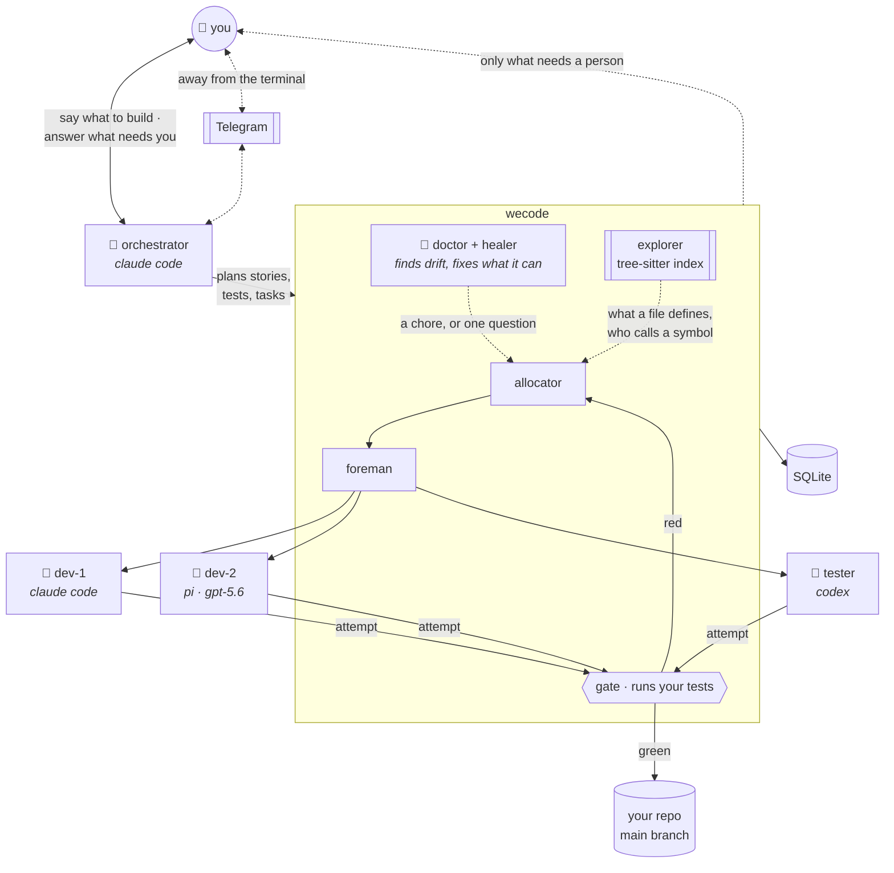
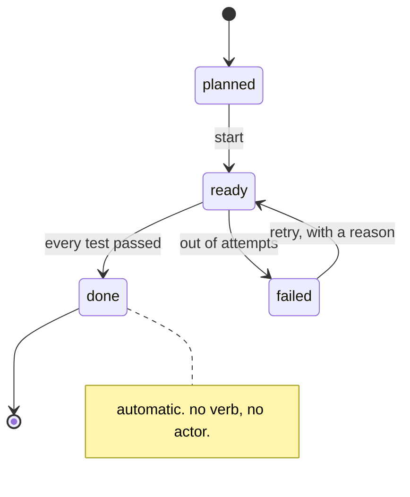

# wecode

## A command center means you're still in it.

Twenty agents, three projects, one of you. Every tool ships a better dashboard for watching
them. wecode ships a team you don't have to watch — work written down as tests, one job per
agent, a tester on a different model than the coder, and nothing merged that didn't prove
itself.

You talk to one agent. It runs the other nineteen.

**No slop, just deliver. We code while you are sleeping.**

---

## Today

```
agent-3: Done! All tests pass. ✅
you:     ...opens a 400-line diff at 1am
```

Sometimes it edited the test. Sometimes its filter matched nothing and exited 0. Sometimes
it worked in a file nobody asked it to touch. You find out at review, or in production, or
never.

## With wecode

```
$ wecode board

needs you (1)
  ● approval · 6m   push this rewrite to the public repo — its history is unrelated
                    a · approve    r · refuse    enter · see the evidence

cooking (3)
  ◆ 4m   task #337  running             dev-2 · claude · 18k
  ◆ 2m   task #341  running             dev-5 · codex · 9k
  ○ 0m   task #344  waiting for a slot

delivered (2)
  story #294  the outline can be narrowed to open work
  story #291  an approval is answered where it is shown
```

One question, and it's the right kind: a one-way door only you can walk through. Press `a`.

Everything reversible — a retry, a stale branch, a scope that was too narrow — is in
`cooking`, and nobody is waiting on you for it. Nothing in `delivered` got there because an
agent said so.

## The shape of it



The tester is a different harness on purpose: a proof written by the model that wrote the
code inherits its blind spots.

## The rules

| | |
|---|---|
| **A ticket is a test** | No test, no task |
| **The test must fail first** | Proved red on your main branch before work starts |
| **Its own repo, its own files** | Anything outside the list is refused, not warned about |
| **Two agents never share a file** | Overlapping work waits instead of racing |
| **The gate runs the test, not the agent** | In the tree the agent worked in, reading the output — not just the exit code |
| **It notices its own drift** | A `done` task with no passing test, a delivered story that never reached your branch, a task nobody can start — found, and fixed where that's safe |
| **It knows your code** | Asks an index what a file defines and who calls a symbol, so a task's file list is derived rather than guessed |

There is no command an agent can run to mark its own work finished.

## Try it

```bash
pnpm install && pnpm -r build
cd /path/to/your/project
wecode init && wecode onboard
```

A story is one document, not fifteen commands:

```yaml
story: 1
requirements:
  - statement: a reset link authenticates exactly one change
    criteria:
      - statement: a link is emailed within 60s
        test: bash test/mail.sh
        tasks:
          - title: send the reset mail
            scope: [src/mail/send.ts, test/mail.sh]
            test: pnpm vitest run mail
```

```bash
wecode plan feature.yaml
wecode-runner      # allocate · run · prove · land, every ten seconds
wecode-tui         # the cockpit
```

Then go to bed.

## Nothing is marked done by hand



A passing test accepts its criteria, which meets its requirement, which delivers its story
and its epic — none of it invoked by anyone. Shipping a release stays your decision.

## Where it is

Built by pointing it at itself: **168 stories, 232 tasks, 2,088 tests green**. Every rule
above is in use by the thing that wrote it.

Also true: it drives **Claude Code** today, with **Codex** and **pi** adapters written and
the model per seat set in config; the healer repairs the causes it can name and escalates
the rest; one machine, one SQLite file, no server; the cockpit has rough edges.

## For agents, and the curious

[`docs/design`](docs/design) — architecture, entities, the ERD, state diagrams, roles,
worktrees, the attention budget, healing, health, the one-assignment model. The state
machines are 118 lines of YAML and the diagrams are generated from them, so they cannot
drift. Packages: `core` · `cli` · `tui` · `runner` · `explorer`.
