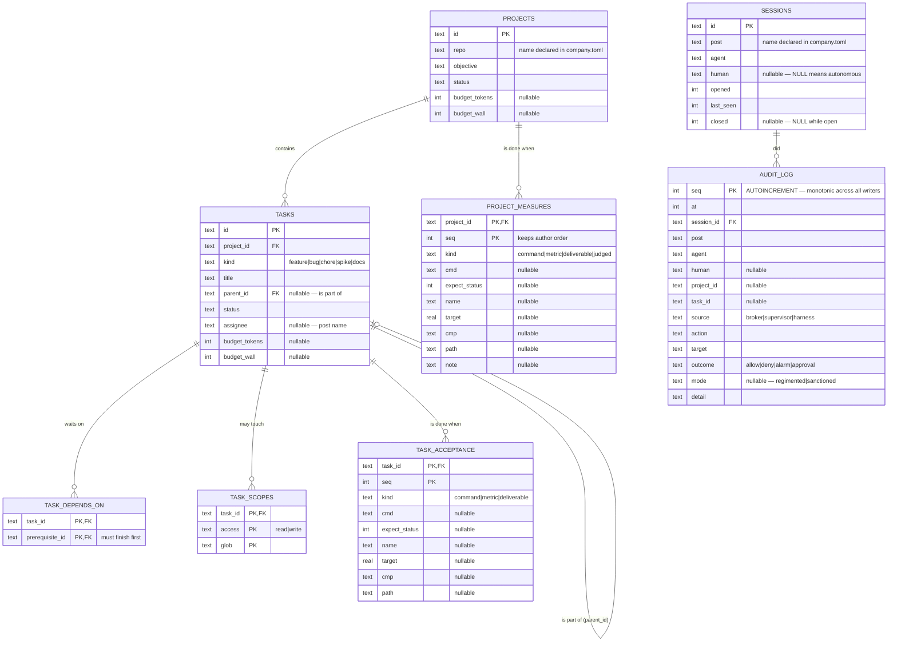
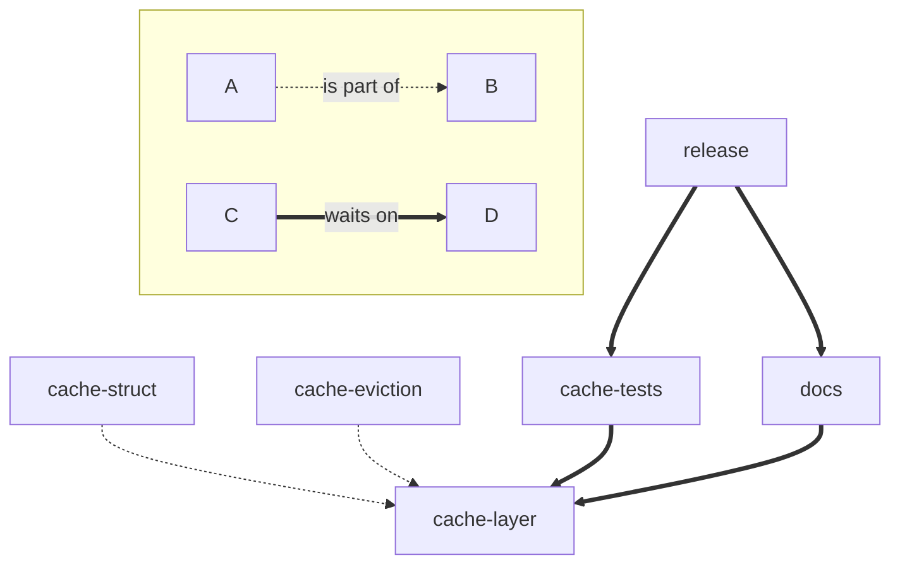
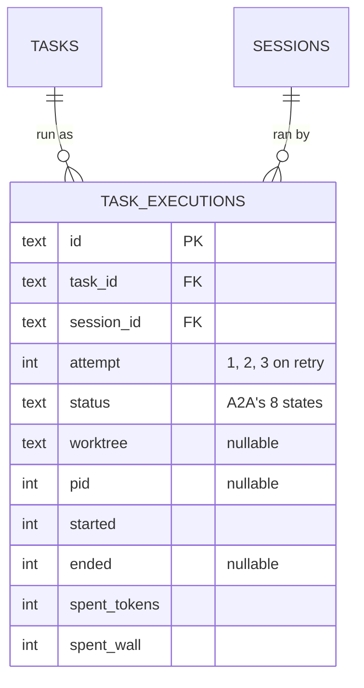

# Data model

Proposed schema for `wecode.db`, for review. Not yet implemented.

A workspace is **two files**:

```
~/.wecode/workspaces/cws/
  company.toml     hand-edited: roles, posts, users, repos, agents, templates
  wecode.db        machine-written: projects, tasks, sessions, audit
```

Configuration stays a file because you edit it, diff it and review it. The database
holds only what the program writes.

---

## Tables



---

## The two task relations

This is the part worth reviewing hardest, because collapsing them is tempting and
wrong.

| | Column / table | Means | Shape |
|---|---|---|---|
| Hierarchy | `tasks.parent_id` | **is part of** | tree — at most one parent, hence a column |
| Sequence | `task_depends_on` | **must come after** | DAG — many-to-many, hence a table |



Reading that diagram:

- `cache-struct` and `cache-eviction` are **parts of** `cache-layer`, and run in
  parallel. Neither waits for the other.
- A subtask is **not blocked by its parent** — `cache-struct` can start immediately;
  it is *how* `cache-layer` gets done.
- `release` waits on **two** prerequisites that are unrelated to each other. A tree
  cannot express that; one parent is not enough.
- Progress counts leaves *under* a task. `cache-tests` must not be a child of
  `cache-layer`, or finishing the tests would count as finishing part of the layer.

## Changes from the first draft

Three polymorphic columns removed, each replaced by a table named for its relation:

| Was | Now | Why |
|---|---|---|
| `task_deps(task_id, depends_on_id)` | `task_depends_on(task_id, prerequisite_id)` | direction was ambiguous; `prerequisite_id` cannot be misread |
| `scopes(owner_kind, owner_id, …)` | `task_scopes(task_id, …)` | only tasks have scopes, so `owner_kind` held no information — and a real foreign key with cascade becomes possible |
| `measures(owner_kind, owner_id, …)` | `project_measures` + `task_acceptance` | same reason, and it matches the domain: a project has *measures*, a task has *acceptance* |
| `audit` | `audit_log` | terse for a table |

Every table now has a real foreign key with `ON DELETE CASCADE`, so deleting a
project cannot leave orphaned rows.

## References the database cannot enforce

Three columns point at names declared in `company.toml`, so SQLite cannot check
them. **They must be validated in code on write**, and this is the one real cost of
keeping configuration in a file:

| Column | Points at |
|---|---|
| `projects.repo` | a `[[repos]]` name |
| `tasks.assignee` | a `[[posts]]` name |
| `sessions.post` | a `[[posts]]` name |

The alternative — repos and posts as tables — would buy referential integrity and
lose hand-editable, reviewable config. Given a role's write scope is exactly the
thing you want to review in a diff, the file wins and the check moves to code.

## Deferred

`task_executions` — one row per *run* of a task, holding the worktree path, pid,
the A2A-aligned status lifecycle, spend totals, and `attempt` as a retry counter.

Deliberately not created yet: nothing writes it until a dispatcher exists, and every
column would be a guess about code that does not exist. `user_version` migration is
already wired up, so adding it later is cheap.

Shape when it lands:



Note the naming: the **execution** is the entity; **attempt** is which try it is.
That also settles a three-way collision — A2A's `Task` maps to `TASK_EXECUTIONS`,
not to our `TASKS`, since A2A has no notion of planned-but-unstarted work.
