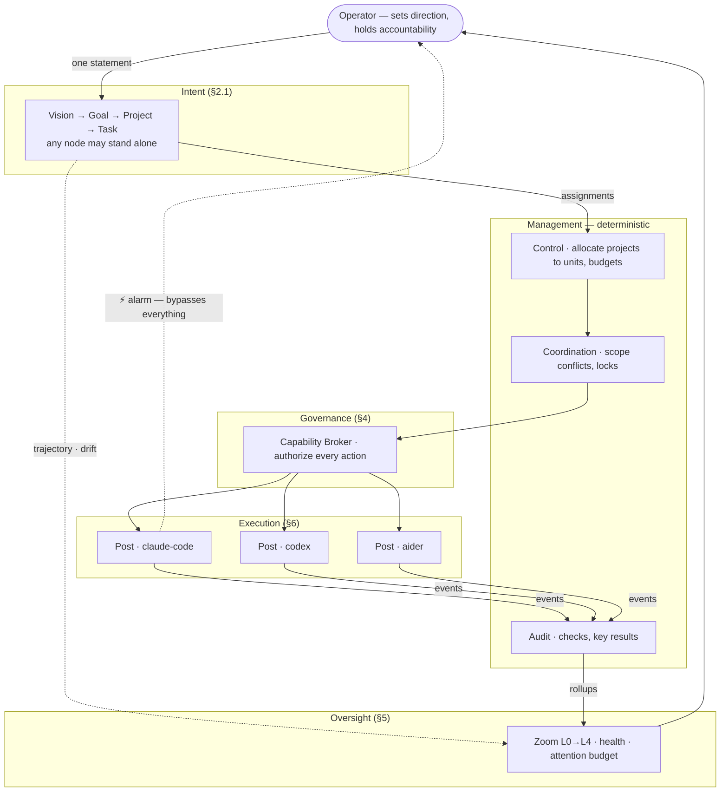

# wecode — Architecture

A Rust runtime for running coding agents as staff. You talk only to the
orchestrator: it holds every project, task and goal in one hierarchy of intent,
enforces what each agent may do, and attenuates what reaches you — so nothing drifts
from the objective it was meant to serve.

- **Theory, prior art and open questions:** [`theory.md`](./theory.md)
- **Design history and rationale for changes:** `git log`

---

## 1. Model



Three rules the whole design follows:

1. **Authority is enforced, never prompted.** A role is a set of checked
   capabilities or it is nothing.
2. **Ground truth over self-report.** Status comes from diffs, exit codes and spend
   — never from an agent's account of its own work.
3. **The operator's attention is the binding constraint.** Concurrency derives from
   it; the runtime throttles itself rather than flooding you.
4. **Every unit of work knows what it serves.** Work that ladders to nothing is a
   detected defect, not a normal state.

---

## 1.1 Vocabulary

Three planes. **No word appears in more than one**, which has not always been true
here and is the reason this section exists.

**Demand — what we want. Static.**

| | Is |
|---|---|
| **Intent** | one node: `Vision` → `Goal` → `Project` → `Task` |
| **Task** | *only* the executable leaf kind of an intent. Never an execution. |

**Supply — who may act. Static.**

| | Is |
|---|---|
| **User** | a person |
| **Agent** | a coding CLI (`claude-code`, `codex`) |
| **Post** | a seat in the org chart, holding a role |
| **Role** | authority — a `Grant` |
| **Assignment** | the durable binding of an intent to a post |

**Execution — what is happening now. Live.**

| | Is | Bounded by |
|---|---|---|
| **Session** | a connection with authority: one post, one agent, optionally a user | idle timeout |
| **Attempt** | one execution of one `Task` intent, by one session | wall and token budget |

```
User ──┐
       ├─ Session ──1:N──> Attempt ──N:1──> Intent (kind = Task)
Agent ─┘     │                 │
           (post)          (worktree, process,
        → Role → Grant     outcome, spend)
```

A session may run many attempts; an attempt belongs to exactly one session. For a
spawned CLI these are 1:1 — the process *is* the attempt — but nothing special-cases
that, because a long-lived agent connected over a protocol does many attempts on one
session.

**A session has no kinds.** Autonomous simply means it has no user. That also keeps
the two limits apart: sessions expire on *idle*, attempts on *budget*.

---

## 2. Intent and organization

Two orthogonal hierarchies. **Intent** is demand — what we are trying to achieve.
**Organization** is supply — who may do what. Assignments bind them.

### 2.1 Intent — the task ontology

One recursive node. Kind gates the grammar; nothing else changes by level.

```rust
pub struct Intent {
    pub id: IntentId,
    pub kind: IntentKind,
    pub statement: String,           // one imperative sentence
    pub parent: Option<IntentId>,    // None ⇒ root or ad-hoc
    pub link: Link,                  // how it serves its parent
    pub sphere: Sphere,
    pub horizon: Horizon,
    pub weight: f32,                 // relative priority among siblings
    pub measures: Vec<Measure>,
    pub status: Status,
}

/// Compound kinds must decompose; only Task is primitive (directly executable).
pub enum IntentKind { Vision, Goal, Project, Task }

pub enum Sphere { Org, Unit(UnitId), Personal }

pub enum Horizon { Indefinite, Year, Quarter, Month, Week, Now }

pub enum Link {
    /// Serves the parent partially. Polarity allows negative contribution.
    Contributes { rationale: String, polarity: Polarity },
    Requires,        // AND — parent needs every such child
    Alternative,     // OR  — any one such child satisfies the parent
    Standalone { reason: StandaloneReason },  // deliberately unaligned
    Unlinked,        // drift: needs triage, surfaced not tolerated
}

pub enum StandaloneReason { Maintenance, Urgent, Exploration, Personal }
```

**Grammar.** Enforced on write, so the tree cannot become incoherent.

| Kind | Parent | Decomposes into | Measures | Assignable |
|---|---|---|---|---|
| `Vision` | none | Goals | `Proxy` only | no |
| `Goal` | Vision, Goal | Goals, Projects | ≥1 `Command`/`Metric` | no |
| `Project` | Goal, Project, none | Tasks | ≥1 | to units; budgeted |
| `Task` | Project, Task, none | *primitive* | acceptance criteria | to one post |

Rules: no cycles; a child's horizon never exceeds its parent's; a compound intent
with no children is incomplete; `parent: None` is legal at every kind — that is how
an ad-hoc task or an independent project exists.

```rust
pub enum Measure {
    Command { cmd: String, expect_status: i32 },   // executable truth
    Metric { name: String, target: f64, cmp: Cmp, source: MetricSource },
    Deliverable { path: Glob },
    Rollup,                                        // derived from children
    Proxy { note: String },                        // human-judged; Vision only
}
```

**Progress** uses own measures if present, else rolls up: `Requires` children
combine as a weighted mean, `Alternative` children as the best child.

### 2.2 Trajectory — not losing the thread

Alignment is measured, not assumed. Computed each cycle from spend and progress:

```rust
pub struct Trajectory {
    pub aligned_spend: f32,                  // share reaching a rooted ancestor
    pub orphan_spend: f32,                   // share on Unlinked intents
    pub starved: Vec<IntentId>,              // no active descendant for N cycles
    pub divergence: Vec<(IntentId, f32)>,    // |spend share − weight|
    pub stalled: Vec<IntentId>,              // spend rising, progress flat
}
```

Each maps to a question the operator would otherwise have to remember to ask:
*what am I paying for that ladders to nothing* (orphan), *which goal have I quietly
abandoned* (starved), *does my effort match my stated priorities* (divergence),
*what is burning money without moving* (stalled). `starved` and `divergence` become
exceptions; the rest appear in the digest.

### 2.3 Definition authority — who sets the deliverable

**A post may never define the criteria it will be judged by.** Everything else here
follows from that.

| Kind | Defined by | Model's role |
|---|---|---|
| `Vision` | operator only; `Proxy` measures, human-judged | none |
| `Goal` | operator authors | may propose, operator confirms |
| `Project` | proposed at intake or by Intelligence; **operator ratifies** — it carries budget | propose |
| `Task` | derived from the parent Project's measures + scope | propose where derivation is impossible |

Rules:

1. **Executor ≠ definer.** The post assigned a task cannot author or amend its
   acceptance. Enforced as separation of duty on the `Define` capability.
2. **Frozen at dispatch.** Amending a measure after work starts requires approval and
   invalidates the attempt. Otherwise criteria drift to fit whatever was produced.
3. **Must serve the parent.** Every task cites which parent measure it advances. New
   criteria cannot appear at leaf level.
4. **A `Judged` measure needs a different post to judge it** — a reviewer role, never
   the executor.

**Resolving this against the attention budget.** Requiring the operator to write
acceptance for every task would consume the attention the design exists to protect.
So authority concentrates where leverage is highest: the operator defines Goals and
ratifies Projects; task-level acceptance is **derived** from the parent's `Command`
measures and scope where possible, model-proposed otherwise, and **sampled by Audit**
rather than individually approved. Definition is owned at the top and spot-checked at
the bottom.

### 2.4 Admission — the formulation gate

Task formulation *is* the orchestration. Nothing dispatches until it is well formed,
and the check is a **type and structure check, not a judgement call**.

```rust
pub enum Admission {
    Draft { defects: Vec<Defect> },      // cannot be assigned
    Admitted { at: CycleId, by: UnitId, waivers: Vec<Waiver> },
}

pub enum Defect {
    StatementCompound,                       // more than one outcome
    StatementVague { term: String },          // the only model-assisted check
    NoParentLink,
    MeasureMissing,
    MeasureNotExecutable { idx: usize },      // Judged where Command/Metric required
    AcceptanceNotCheckable { idx: usize },
    ScopeMissing,
    ScopeTooBroad { glob: String },
    ScopeOverlaps { with: IntentId },
    BudgetMissing,
    HorizonExceedsParent,
    NoCapableUnit { function: Function },
}
```

**Every defect except `StatementVague` is decided by inspecting types and the tree** —
`Measure::Judged` is not executable, `**` is not a scope, a missing parent is a
missing field, sibling globs either intersect or they do not. Vagueness is the single
place a model assists, and it only ever *raises* a question; it can never admit an
intent.

Each defect carries a fixed question. Admission is a dialogue with whoever created
the intent — operator, Intelligence, or a decomposing post:

```
$ wecode "make the export faster"

  ⚠ 3 defects — not assignable

  1  measure missing
     How do we know this is done? A command or a metric with a target.
     > k6 run load/export.js, p95 under 5s

  2  scope missing
     Which paths may change?
     > crates/export/**

  3  statement vague: "faster"
     Faster than what, by when? (horizon)
     > this month

  ✓ admitted — Project under Goal: cut p99 latency
```

Rules: a `Draft` cannot be assigned; admission is recorded with its author; a
`Waiver` is explicit, attributed and surfaced by Audit, so skipping a check is
visible rather than silent. Re-opening an admitted intent to change a measure follows
§2.3 rule 2 — approval, and the attempt is invalidated.

**Kept off the attention budget:** derivable fields are derived before asking (scope
from the parent, measures inherited from a parent's `Command`, horizon from the
parent), so questions are only ever about what genuinely cannot be inferred. A
conversational or exploratory task admits with `Standalone { Exploration }` and a
relaxed checklist — it still needs a scope and a budget, just not a metric.

### 2.5 Organization

```rust
/// One recursive type at every scale: org, group, or a single seat.
pub struct Unit {
    pub id: UnitId,
    pub name: String,
    pub kind: UnitKind,
    pub parent: Option<UnitId>,
    pub children: Vec<UnitId>,
    pub charter: Charter,
    pub roles: Vec<RoleId>,
    pub grant: Grant,          // capabilities, delegated from parent
}

pub enum UnitKind {
    Group,                     // a lens over children; nests arbitrarily
    Post { agent: AgentId },   // a seat; the leaf where work happens
}

/// A unit's identity and hard limits.
pub struct Charter {
    pub purpose: String,
    pub invariants: Vec<Invariant>,   // violation raises an alarm, never a retry
    pub escalate_to: Option<UnitId>,  // None ⇒ the operator
}

pub enum Invariant {
    NeverTouch(Vec<Glob>),
    NeverRun(CommandPattern),
    MaxSpend(Budget),
    RequireApproval { action: ActionKind, by: RoleId },
}
```

**Post vs. agent.** A `Post` is a seat with a role, a grant and a reporting line;
an agent is whoever occupies it. Swap `claude` for `codex` in a seat without
touching the org, and audit records stay meaningful across the swap.

### Roles

```rust
/// WHAT a unit is for — drives routing.
pub enum Function {
    Engineering, Quality, Security, Research, Release, Review, Docs,
}

/// HOW MUCH authority it carries — drives enforcement.
pub struct Role {
    pub id: RoleId,
    pub title: String,
    pub function: Function,
    pub grants: Vec<Capability>,
    pub inherits: Vec<RoleId>,
}
```

### Capabilities

```rust
pub enum Capability {
    ReadPaths(Vec<Glob>),
    WritePaths(Vec<Glob>),
    RunCommand(CommandPattern),
    Network(NetworkScope),
    SpendTokens(u64),
    SpendWall(Duration),
    MergeTo(BranchPattern),
    Approve(ActionKind),
    Delegate(Box<Capability>),
    Staff(UnitKind),
    Introspect(IntrospectScope),   // read own intent / ancestors / conventions
    Define(IntentKind),            // author or amend measures at this level (§2.3)
}
```

Selection rule: if it cannot be checked *before* the action occurs, it is not a
capability — it is advice, and belongs in the prompt.

### 2.6 Assignment — binding demand to supply

```rust
pub struct Assignment {
    pub intent: IntentId,              // a Project or Task
    pub unit: UnitId,
    pub effective: Grant,              // unit.grant ∩ intent.grant
    pub allocation: f32,               // share of unit capacity
    pub budget: Budget,
    pub workflow: Option<WorkflowRef>, // how this unit discharges it
}
```

### 2.7 Users and sessions

A **user** is a person, holding a seat:

```toml
[[users]]
name = "chandra"
post = "chief"

[[posts]]
name  = "chief"
role  = "chief"
agent = "claude-code"     # a post with no user is an agent-only seat

[session]
ttl = "8h"                # idle timeout
```

A **session** is one connection with authority. `login` opens one; every command
refreshes it; idling past the TTL expires it.

```rust
pub struct SessionInfo {
    pub id: SessionId,
    pub post: String,
    pub agent: String,
    /// None ⇒ autonomous. The only thing distinguishing an agent session.
    pub user: Option<String>,
    pub opened: u64,
    pub last_seen: u64,
}
```

Resolution order for who is acting, applied to every state-changing command:

1. `--session <id>`
2. `$WECODE_SESSION`
3. exactly one active session — the solo case, zero friction
4. `--as <post>` — a deliberate override
5. **refuse**, listing active sessions and available users

Step 5 matters more than the rest: **nothing reaches the root grant by omission.**
`--as operator` remains available but must be typed.

**Autonomous agents never create or present a session.** A dispatched worker is
confined to a worktree and cannot reach the workspace (§10), and needs no access
anyway (§4) — the supervisor opens the session, holds the id, and records on the
worker's behalf from exit codes, diffs and spend. Were workers to present a session
id, one could pass another seat's and inherit its authority; presenting nothing
removes that class of escalation entirely.

There is **no credential** anywhere in this design. `login` selects a seat; it does
not authenticate. Anyone with filesystem access to the workspace can log in as
anyone, which is fine for a solo operator and must not be mistaken for security.

Allocation across assignments is arithmetic (§3, Control). Only `Project` and
`Task` intents are assignable — a Goal is reached by satisfying its children, never
by being handed to a unit.

---

## 3. Management functions

Five functions exist at every non-leaf level. All but the last are deterministic.

| Function | Does | Model? |
|---|---|---|
| **Coordination** | prevents collisions between units — write-scope arbitration, shared locks and conventions | no |
| **Control** | allocates projects to units; budgets, capacity, dispatch. Weighted shortest job first | no |
| **Audit** | samples execution directly, bypassing Control: checks, key results, scope verification | no |
| **Policy** | charter invariants, approval requirements, escalation terminus | no |
| **Intelligence** | proposes projects, replans on exception | **yes** |

The components that run most often are arithmetic. Model calls happen inside a
post (doing the work) and in Intelligence (deciding what work exists).

---

## 4. Governance

### The Broker

```rust
pub trait Broker: Send + Sync {
    /// Called before every consequential action. No bypass path exists.
    fn authorize(&self, sess: &SessionId, act: &Action) -> Decision;
    fn record(&self, sess: &SessionId, act: &Action, d: &Decision, out: &Outcome);
}

pub enum Decision {
    Allow,
    Deny { reason: DenyReason, alarm: bool },
    RequireApproval { by: RoleId, timeout: Duration },
}

/// A session activates a subset of roles — least privilege per task.
pub struct Session {
    pub id: SessionId,
    pub post: UnitId,
    pub occupant: AgentId,
    pub intent: IntentId,
    pub active_roles: Vec<RoleId>,
    pub effective: Grant,      // ∩ of unit, role and intent grants — never ∪
    pub spent: SpendCounters,
}
```

Delegation only ever narrows: a parent cannot grant what it does not hold.

### Enforcement points

| Capability | Enforced at | Strength |
|---|---|---|
| `WritePaths` | worktree confinement + post-hoc diff scope check | strong |
| `SpendTokens` / `SpendWall` | counter pre-dispatch + mid-flight kill | strong |
| `MergeTo` | wecode performs all merges; agents never do | strong |
| `Approve` | transition blocked until a holder signs | strong |
| `Staff` | only Control instantiates units, within its own grant | strong |
| `RunCommand` | argv pattern match at spawn | medium — a shell inside an allowed command escapes it |
| `ReadPaths` | worktree contents | medium |
| `Network` | env allowlist; proxy when containerized | weak without a container |

This bounds blast radius, not correctness, and it is not a boundary against a
hostile agent. Containers close the weak rows.

### Regiment or sanction

Split by **reversibility**, not severity.

```rust
pub enum ControlMode {
    Regimented,                        // violation impossible
    Sanctioned { sanction: Sanction }, // violation possible, recorded, penalized
}

pub enum Sanction {
    RejectDeliverable,
    RevokeCapability(Box<Capability>),
    RequireApprovalHenceforth(RoleId),
    Unstaff,
}
```

| Action | Mode |
|---|---|
| merge to protected branch, invariant-matching command, secret in a diff, spend over ceiling | **regimented** |
| write outside scope, allocation overrun, missed key result, touching another unit's files | **sanctioned** |

A post that repeatedly writes outside its scope indicates the *scope* is wrong.
Sanctioning surfaces that pattern; regimenting it away discards the signal.

### State access

Who may reach the intent tree, grants and event log — and how.

| Consumer | Access | Mechanism |
|---|---|---|
| Control, Coordination, Audit, Policy | read/write | **in-process Rust**; same binary, direct store calls. Not a protocol |
| Oversight TUI | read | in-process, plus tailing `events.jsonl` |
| Intake / Intelligence model calls | **none** | receive a rendered prompt, return structured output. Stateless |
| Worker agents (posts) | **none by default** | task envelope only: intent statement, ancestor chain, acceptance, scope |
| Worker agents, opt-in | narrow read | **MCP**, capability-gated (`Introspect`) — see below |
| External systems and agents | task-level | **A2A** northbound, never the store |

**The store is never reachable by an agent.** All writes go through the Broker; no
agent receives a database handle or path. An agent that could write `Intent` or
`Grant` rows could assign itself work and widen its own authority, which would
defeat every control in this section.

Management is not an agent talking to a system over a protocol — it is code with a
function call. MCP and A2A exist only at the edges where something *outside* the
process needs in.

### Audit plane — one ledger across every harness

Each coding CLI keeps its own logs in its own shape, and none of them know about the
others. Every consequential fact lands instead in **one append-only ledger** with one
record type, so a question can be asked once rather than per harness.

```rust
pub struct Record {
    pub seq: u64,                      // monotonic; the ledger is append-only
    pub at: Timestamp,
    pub actor: Actor,                  // Operator | Post{post, occupant} | System(Function)
    pub intent: Option<IntentId>,      // ─┐
    pub task: Option<AttemptId>,          //  │ correlation keys
    pub session: Option<SessionId>,    // ─┘
    pub caused_by: Option<u64>,        // causal parent — reconstructs the chain
    pub action: Action,
    pub authority: Option<Authority>,  // the grant and Decision that permitted it
    pub outcome: Outcome,
    pub cost: Cost,                    // tokens, wall, and money
    pub source: Source,
}

/// Trust marking. Same principle as diff-over-self-report, applied to telemetry.
pub enum Source {
    Broker,                            // authoritative — we decided it
    Supervisor,                        // authoritative — we observed it (exit code, diff, spend)
    Harness { adapter: String },        // best-effort — the agent's own account. Untrusted
}
```

`source` is the load-bearing field. A harness's self-reported tool log is useful for
debugging and inadmissible as evidence; marking it at write time stops the two being
confused later. Anything that gates a decision comes from `Broker` or `Supervisor`.

Because `intent`, `task` and `caused_by` are on every record regardless of which agent
produced it, cross-harness questions become ordinary queries:

```
wecode audit --path 'crates/auth/**' --since 7d     # who touched this, any agent
wecode audit --intent <id> --tree                   # everything under a goal
wecode audit --denied                               # refused actions and why
wecode audit --cost --group-by intent               # spend by objective
wecode audit --waivers                              # admission checks skipped
```

The ledger is `audit.jsonl` in the state dir, outside every worktree and unreachable
by any agent. `Record` maps cleanly onto an OTel span (`caused_by` → parent span), so
export is a projection rather than a second instrumentation path.

#### Optional introspection over MCP

Some tasks legitimately need context the envelope omits: *what goal does this
serve?*, *what did the previous attempt try?* For adapters that speak MCP, wecode
can expose a minimal read-only server:

```
my_intent()        → statement, acceptance, scope, ancestor chain
prior_attempts()   → summaries and failures for this step
conventions()      → project conventions in scope
report_progress()  → the only write; a note, not a status claim
```

Gated by an `Introspect` capability, because information access is authority: a
post that can read the whole tree can reason about work it was not given. Default
off. `report_progress` cannot set status — status stays computed from diffs and exit
codes (rule 2), so an agent still cannot declare its own success.

---

## 5. Oversight

The interface is the product: if attention is the constraint, everything else is
scaffolding for making it trustworthy.

### Attention budget

```rust
pub struct Attention {
    pub max_open_items: usize,          // default 5
    pub max_interrupts_per_hour: u8,    // default 3
    pub digest_interval: Duration,
    pub auto_approve_below: RiskLevel,
}
```

When demand exceeds budget the system throttles itself, in order:

1. **Batch** — three agents wanting `Cargo.lock` is one question.
2. **Auto-resolve** below `auto_approve_below`; report in the digest.
3. **Throttle dispatch** — `effective_parallel = min(configured, cores-2, headroom())`.
4. **Pause and summarize** if the queue stays saturated.

### Zoom

Every level renders the same five columns — **identity · health · progress ·
spend · needs-you** — so navigation is uniform all the way down.

```
  ┌ L0 PORTFOLIO ─────────────────────────────── ⏎ descend · ␣ digest ─┐
  │  ▸ oauth-flow     ●amber  ████▁▁ 62%   142k/300k   1 approval      │
  │  ▸ latency-p99    ●green  ██▁▁▁▁ 30%    38k/200k   —               │
  │  ▸ soc2-evidence  ●red    █▁▁▁▁▁  8%    91k/100k   ⚡ALARM budget    │
  └────────────────────────────────────────────────────────────────────┘
  ┌ L2 UNIT · backend ─────────────────────────── ⌫ up · ⏎ down ───────┐
  │  ▸ impl-api   claude-code  working    +214/-31  71k   idle 0m      │
  │  ▸ test-api   codex        ⚠ stuck    +12/-0    27k   idle 14m     │
  └────────────────────────────────────────────────────────────────────┘
  ┌ L3 POST · test-api ──────────────────────────────── d diff · c ────┐
  │  step   write tests for device-code polling                        │
  │  scope  tests/**                              ✓ within scope       │
  │  ⚠ no diff growth 14m · `cargo test` 7× · same failure 3×          │
  │  [a] adopt  [r] retry+context  [k] kill  [s] steer  [L4] raw       │
  └────────────────────────────────────────────────────────────────────┘
```

L0 is the default and the only view you must read. L4 is the raw event stream —
for debugging, not monitoring.

### Health

Computed, never asked.

```rust
pub enum Health { Green, Amber, Red }

pub struct Vitals {
    pub diff_growth: BytesPerMin,
    pub verify: Option<CheckOutcome>,
    pub idle: Duration,
    pub burn: f32,          // spend ÷ progress
    pub rejects: u8,
    pub tool_repeats: u8,
}
```

**Stuck** (⇒ Amber, queued): no diff growth for N minutes, identical verify failure
≥3×, same tool ≥K times, or spend rising with flat progress.

### Steering

| Key | Action | Mechanism |
|---|---|---|
| `a` | adopt work so far | commit worktree, mark done |
| `r` | retry with context | cancel + restart, prior failure and your note attached |
| `n` | narrow scope | tighten the grant, then retry |
| `s` | steer | write `.wecode/inbox/` — only if the adapter cooperates |
| `k` | kill | cancel, discard worktree, free the slot |

The UI states which are reliable for the current adapter rather than offering
buttons that silently do nothing.

### What reaches you

| Priority | Surfaces as | Blocking |
|---|---|---|
| Alarm | immediate; dispatch frozen; needs ack | yes |
| Approval blocking work | batched queue | batched |
| Exception — retries exhausted, rejected 3× | queue | no |
| Agent question | queue, with diff so far | no |
| Progress | pull only | no |

Silence on green. Progress is pulled, never pushed.

---

## 6. Execution substrate

### Agent trait

```rust
#[async_trait]
pub trait Agent: Send + Sync {
    fn id(&self) -> &AgentId;
    fn capabilities(&self) -> &AgentCaps;
    async fn execute(&self, a: AttemptSpec, ctx: ExecCtx)
        -> Result<AttemptOutcome, AgentError>;
}
```

Implementations: `CliAgent` (a coding CLI as a supervised subprocess) and
`A2aAgent` (a remote agent occupying a post). Everything above this trait is
protocol-agnostic.

```rust
pub struct AttemptSpec {
    pub attempt_id: AttemptId,
    pub session: SessionId,     // the connection running it (§2.7)
    pub intent: IntentId,       // must be kind == Task
    pub number: u8,             // 1, 2, 3 on retry
    pub workspace: WorkspacePath,
    pub context: Vec<ContextItem>,
    pub prior_failure: Option<String>,
}

pub struct AttemptOutcome {
    pub attempt_id: AttemptId,
    pub status: AttemptStatus,
    pub summary: String,
    pub changed_files: Vec<FileChange>,
    pub commit: Option<CommitSha>,
    pub usage: Usage,
}

/// A2A's eight states, so a protocol bridge stays a mapping.
pub enum AttemptStatus {
    Submitted, Working, InputRequired, AuthRequired,
    Completed, Failed, Canceled,
    Rejected,   // WE declined the output — e.g. scope violation
}
```

### Adapters

Adapter definitions are data; stream parsers are code.

```toml
# adapters/claude-code.toml
name     = "claude-code"
command  = "claude"
protocol = "claude-stream-json"
args     = ["-p", "{{prompt}}", "--output-format", "stream-json", "--verbose"]
cwd      = "{{workspace}}"
env_allowlist = ["ANTHROPIC_API_KEY", "PATH", "HOME"]

[capabilities]
edits_files = true
tags = ["general", "rust"]

[limits]
wall_secs = 1800
idle_secs = 300
max_output_bytes = 8_000_000

[health]
probe = ["claude", "--version"]
```

```rust
pub trait EventParser: Send {
    fn feed(&mut self, chunk: &[u8], out: &mut Vec<AgentEvent>);
    fn finish(&mut self, exit: ExitStatus, out: &mut Vec<AgentEvent>);
}
```

Shipped: `ClaudeStreamJson`, `GenericJsonl`, `PlainRegex`, `Passthrough`.

### Events

```rust
pub enum AgentEvent {
    Started { post: UnitId, task: AttemptId, pid: Option<u32> },
    Message(String),
    ToolCall { name: String, brief: String },
    ToolResult { name: String, ok: bool, brief: String },
    FileChanged { path: PathBuf, kind: ChangeKind },
    CommandRun { cmd: String, status: Option<i32> },
    Usage(Usage),
    NeedsInput { question: String },
    Finished { status: AttemptStatus, summary: String },
    Failed { error: String, retryable: bool },
    Raw { line: String },
}
```

### Process supervision

`cwd` pinned to the worktree, env reduced to the allowlist, stdout/stderr
line-framed into the parser, wall and idle timeouts, output cap, and cancellation
via SIGINT then SIGKILL **on the process group** — coding CLIs spawn children.

### Result trust order

1. `git diff` of the worktree — ground truth
2. `.wecode/result.json` — status and summary, if valid
3. exit code + parsed events — fallback, normalized by one model call

The diff always wins. If `result.json` claims success and the diff is empty where
one was required, the task failed.

### Workspaces

One git worktree per task under the state dir (§10), branched from the run
branch. **Agents never commit and never merge** — wecode does both after checks
pass. On merge conflict, a resolve-conflict step is dispatched like any other.
The operator's working tree is never touched; output is a branch to review.

### Protocol boundaries

**The `Agent` trait is the only protocol boundary.** Everything above it is
in-process Rust; each implementation chooses its own wire below it. A2A carries
exactly one hop.

| Hop | Mechanism |
|---|---|
| Control → Coordination → Broker → dispatch | Rust function calls, one process |
| Dispatch → post | `AttemptSpec` rendered to a text envelope + argv |
| Post → orchestrator | stdout → parser → `AgentEvent`; then `result.json`; then the diff |
| Post → post | **none** — forbidden (see Topology) |
| Orchestrator → operator | in-process events, TUI, digest |
| **wecode ↔ remote agent** | **A2A** — `A2aAgent` southbound, `A2aServer` northbound |
| Post → its own tools | MCP, configured in the CLI, not by us |
| Post → wecode, opt-in | MCP introspection (§4, `Introspect`) |

A "task" is not an actor and has no protocol: it is a dispatched attempt, handed to
an `Agent` impl as a struct. `CliAgent` turns that into argv and parses stdout;
`A2aAgent` turns it into a `SendMessage` call. Nothing internal gains anything from
HTTP and JSON-RPC to reach a process on the same machine.

What *is* A2A-shaped is the **data model, not the transport** — `AttemptStatus` is
A2A's eight states, outcomes map to `Artifact`, context items to `Message`/`Part` —
so bridging at either edge stays a mapping rather than a redesign.

### Topology

Posts never talk to each other. Communication follows reporting lines: directives
down (amplified), reports up (attenuated), sideways only through Coordination.
Budget and scope are enforceable only at a chokepoint, and a total-order event log
is what makes resume possible.

---

## 7. Channels

```rust
pub enum Signal {
    Directive { to: UnitId, intent: Intent, grant: Grant, budget: Budget },
    Report    { from: UnitId, cycle: CycleId, rollup: Rollup },
    Exception { from: UnitId, kind: ExceptionKind, evidence: Evidence },
    Alarm     { from: UnitId, kind: AlarmKind, evidence: Evidence },
}

/// Bounded by type, so attenuation is not a convention.
pub struct Rollup {
    pub cycle: CycleId,
    pub health: Health,
    pub progress: Vec<(IntentId, f32)>,
    pub spend: SpendCounters,
    pub deliverables: Vec<ArtifactRef>,   // pointers, not content
    pub exceptions: Vec<ExceptionKind>,   // ≤ N, most severe first
    pub note: BoundedString<512>,
}
```

**Alarms bypass every level and reach the operator directly.** Triggers: an
invariant-violating action attempted, a secret detected in a diff, spend over
150% of allocation, the same step rejected ≥3× across different occupants, a write
attempted outside the worktree, or adapter health failing fleet-wide.

Handling is deterministic and immediate: halt the session, freeze dispatch for the
project, require acknowledgement. No model call sits on this path.

### Capacity

```rust
pub struct Capacity {
    pub max_reports_per_cycle: usize,
    pub max_open_exceptions: usize,
    pub max_concurrent_projects: usize,
    pub decision_budget: Budget,
}
```

Sustained overload at a level triggers, in order: attenuate harder → split the
unit and add a level → escalate. A level persistently *under* capacity is
collapsed.

---

## 8. Configuration

```toml
# org.toml
profile = "solo"                  # solo | team | enterprise

[attention]
max_open_items          = 5
max_interrupts_per_hour = 3
digest_interval         = "20m"
auto_approve_below      = "low"

[[units]]
name  = "backend"
posts = ["impl-api", "test-api"]

[[posts]]
name  = "impl-api"
agent = "claude-code"
roles = ["engineer"]

[[posts]]
name  = "test-api"
agent = "codex"
roles = ["tester"]

[roles.engineer]
write = ["crates/**", "src/**"]
run   = ["cargo *", "npm test"]
spend = { tokens = 200_000, wall = "30m" }

[roles.tester]
read  = ["**"]
write = ["tests/**"]              # cannot weaken code to pass a test
run   = ["cargo test*"]

[invariants]
never_touch = [".github/**", "infra/**", "**/*.pem"]
never_run   = ["git push --force*", "npm publish", "terraform apply"]
max_spend   = { tokens = 1_000_000, wall = "4h" }

[defaults]
isolation = "worktree"
retries   = 1
verify    = [{ shell = "cargo test --workspace", expect_status = 0 }]
```

`profile` gates features: `solo` omits RACI, Intelligence, separation of duties and
self-restructuring; `team` adds RACI and role-based approvals; `enterprise` adds
the rest.

---

## 9. Commands

```
wecode "<anything>"              # the only entry point you need — see §9.1
wecode up                        # oversight TUI (default with no args)

wecode intent ls | show <id> | tree     # inspect the ontology
wecode intent link <id> --to <id>       # resolve drift
wecode run <intent>              # allocate and dispatch
wecode run <intent> --workflow feature
wecode approve | deny <item>
wecode ack <alarm>               # clear an alarm, resume dispatch
wecode post ls | probe | staff <post> <agent>
wecode audit <run-id>            # what happened, and under whose authority
wecode resume <run-id>
```

### 9.1 Intake

`wecode "<anything>"` is the single control driver. The orchestrator classifies the
statement, proposes where it belongs, and **the operator confirms before anything
is committed** — silent placement is how a tree stops matching reality.

```
$ wecode "users keep hitting the 30s timeout on export"

  kind    Project          parent  Goal: cut p99 latency below 500ms
  link    Requires         sphere  Org        horizon  Month
  measure cmd: `k6 run load/export.js`  →  p95 < 5s

  [⏎] accept   [p] reparent   [k] change kind   [s] standalone   [e] edit
```

Placement is the one demand-side decision a model makes. If no parent fits, the
proposal is `Standalone` with a reason — never `Unlinked`, which exists only as a
detected defect for intents that arrived without triage.

---

## 10. Layout

```
crates/
  wecode-core          # types and traits
  wecode-gov           # Broker, grants, sessions, audit
  wecode-org           # units, posts, roles, charters, config
  wecode-mgmt          # coordination, control, audit, policy
  wecode-agent         # Agent impls, adapters, parsers, supervision
  wecode-workspace     # worktrees, scoping, diffs, merges
  wecode-store         # event log + SQLite index + resume
  wecode-llm           # model providers
  wecode-tui           # oversight interface
  wecode-cli           # bin: wecode
adapters/              # one TOML per coding CLI
```

### State location

State lives **outside the repository**, because a post's cwd is its worktree and
`..` must not reach authority data:

```
$XDG_STATE_HOME/wecode/<repo-id>/
  runs/<id>/events.jsonl     # authoritative; resume is a fold over this
  index.sqlite               # rebuildable index
  audit.jsonl                # every Broker decision
wt/<task-id>/                # worktrees, siblings of each other, outside the repo
```

A worktree still reaches the main repo through its `.git` pointer — that is fine, it
may read code. What it must not reach is `index.sqlite`, `audit.jsonl` or any grant
definition. Nothing under the repo root holds state; `.wecode/` in-repo is reserved
for the task-local `result.json` and `inbox/`, both writable and both untrusted.

Dependencies: `tokio`, `tokio-util`, `serde`, `serde_json`, `thiserror`, `anyhow`,
`clap`, `tracing`, `reqwest` (rustls), `rusqlite` (bundled), `minijinja`,
`globset`, `schemars`, `async-trait`, `ratatui` + `crossterm`. `git` is invoked as
a subprocess rather than linking libgit2.

---

## 11. Build order

Enforcement before intelligence; a governed agent you can see beats a hierarchy
you cannot.

| # | Delivers |
|---|---|
| **0** | Intent ontology + **admission gate** (§2.4): grammar enforcement, deterministic defect checks, the clarify dialogue, `intent tree` |
| **1** | One post executes one task: adapter, supervision, worktree, event stream, JSONL log |
| **2** | Broker with every §4 enforcement point, grants, sessions, and the audit plane (one ledger, `source` marking, `wecode audit` queries) |
| **3** | Oversight TUI: zoom L0–L4, computed health, stuck detection, attention budget, digest, `Trajectory` |
| **4** | Retries with prior-failure context, scope rejection, sanctions, resume |
| **5** | Projects and Control: ≥2 projects, deterministic allocation, budgets, capacity |
| **6** | Coordination: cross-post scope arbitration, locks, shared conventions |
| **7** | Alarms: the §7 triggers, freeze, acknowledge, resume |
| **8** | Approvals, role-based sign-off, Audit sampling |
| **9** | Depth >1: rollup attenuation, overload response |
| **10** | Intelligence: proposes projects, replans |
| **11** | A2A server and client; container isolation |

Steps 1–4 are the usable product for one operator. Everything after is judged on
whether daily use surfaces the problem it solves.
