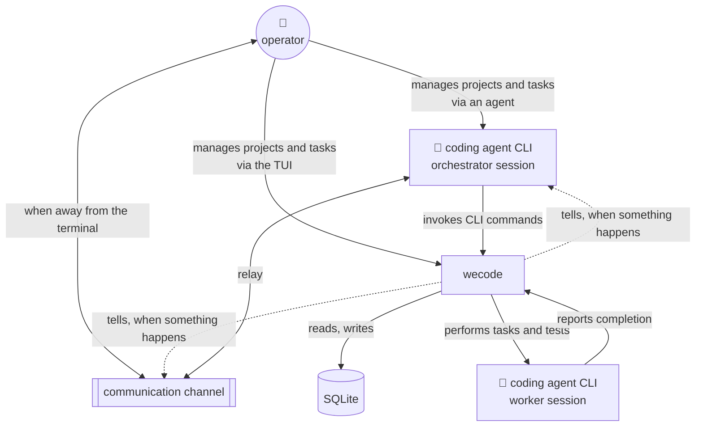
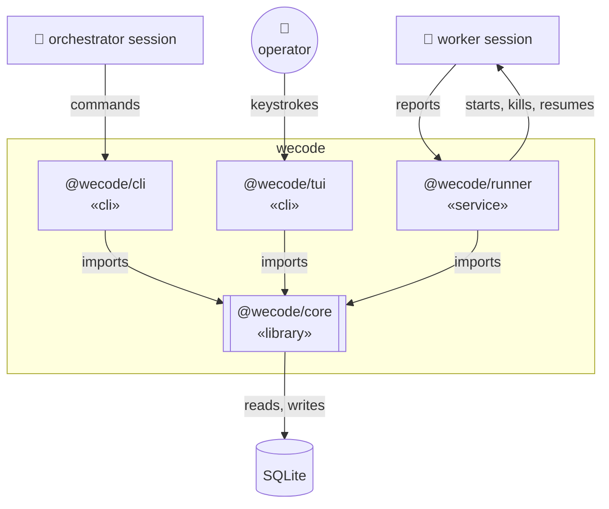
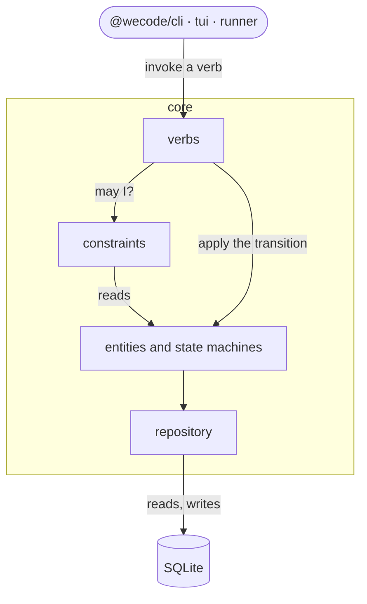
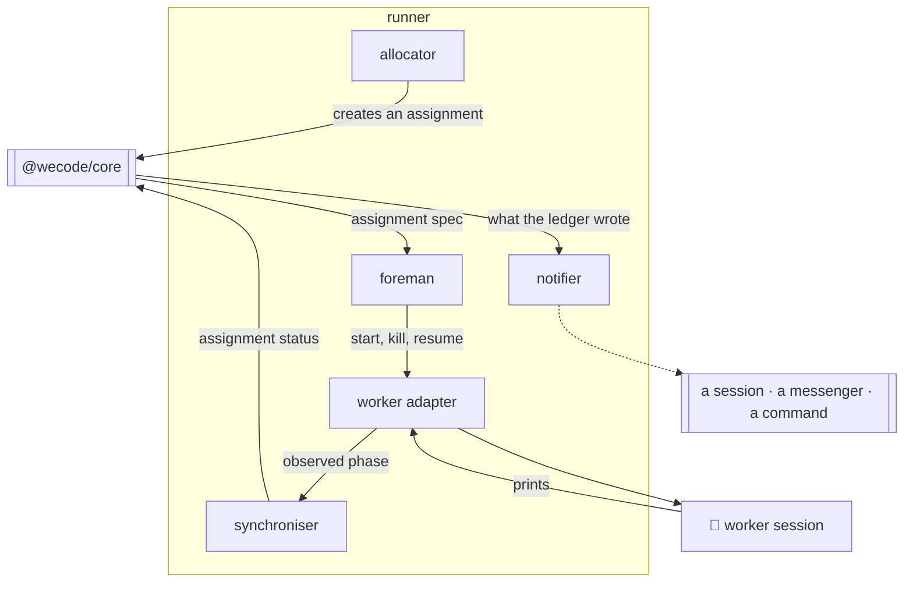

# Architecture

wecode is deterministic project management for a developer and their coding agents. Work is
written down as tests before it is built, agents are given one task each inside a scope they
cannot leave, and nothing is ever finished because an agent said so — a task is done when
its tests pass, and a story is delivered when every test that proves it passes. No slop,
just deliver.

## L1 — system context

| box | what it is |
|---|---|
| **operator** | you. You say what to build |
| **orchestrator session** | a coding agent you start and talk to. It turns what you said into stories, tests and tasks |
| **wecode** | holds the work, the rules for when work is done, and runs the agents that do it |
| **SQLite** | where all of it is written down |
| **worker session** | a coding agent wecode starts, one per task, to write the code and its tests |
| **communication channel** | Telegram or similar, so the orchestrator can reach you when you are not at the terminal |

Both agent boxes are the same program. You start the orchestrator; wecode starts the workers.

## L2 — containers

Two things you run, one that runs itself, one library they all import, and the file it
writes.

| container | what it is | when it runs |
|---|---|---|
| **@wecode/cli** «cli» | every verb, as a command. The only way an agent reaches wecode | once per command |
| **@wecode/tui** «cli» | the board, and the few verbs worth typing while looking at a row | while you are watching |
| **@wecode/runner** «service» | decides what to run, runs it, and keeps the record matching reality. Runs as `wecode-runner`, under systemd | always |
| **@wecode/core** «library» | the entities, their states, and the constraints that guard every transition. A library, not a service | inside whichever container is running |
| **SQLite** | the record | — |

**The core decides nothing.** It answers verbs and refuses the ones its constraints forbid.
Everything that happens on a clock lives in `@wecode/runner`, which is a client of the core
like any other.

## L3 — inside @wecode/core

| component | owns |
|---|---|
| **verbs** | the whole surface: one definition per verb — name, arguments, the entity it acts on. The CLI's commands and the runner's calls are both generated from this list |
| **entities and state machines** | the thirteen entities, their states, and every legal transition |
| **constraints** | the guards: what must be true to enter a state, and the cascade that follows when a child completes |
| **repository** | the only thing that speaks to SQLite |

**Nothing here runs on a clock.** A verb is invoked, a guard answers, a transition is
applied, a row is written. Every decision about *when* belongs to a client.

## L3 — inside @wecode/runner

| component | owns | changes when |
|---|---|---|
| **allocator** | picks the next ready work, binds a worker, creates the assignment — within the attention budget | policy changes: the budget, priority, what may run beside what |
| **foreman** | takes an assignment and makes it real: starts the session, watches it, kills it, resumes it | the world changes: a new harness, a new flag, a machine elsewhere |
| **synchroniser** | writes what was observed back to the core, so the record and reality agree on every tick. The reconciler half of the loop | the shape of the record changes |
| **worker adapter** | one per kind of worker. The only thing that knows the difference | a new kind of worker appears |
| **notifier** | one per way of reaching somebody. Reads what the ledger wrote and tells whoever the workspace's hooks name | a new way out appears |

**The two adapters are the same idea pointed opposite ways.** One reaches a worker so work
can happen; the other reaches a watcher so somebody learns it did. Above either there are
tasks and events; below them there are flags, a session id, or a shell command.

| worker kind | reached by | today |
|---|---|---|
| local coding agent CLI | a process, with flags — `--allowedTools`, `--add-dir`, `stream-json` | built |
| remote coding agent | A2A over HTTP, or a session over SSH | not built |
| a person | asked through the communication channel, answers when done | not built |

Above the adapter there are assignments and phases. Below it there are flags, or a URL, or a
message to somebody. **That is where a role stops being a set of verbs and becomes whatever
that kind of worker understands.**

## How it works, end to end

You want password reset.

1. You tell the orchestrator, in a sentence. It asks what *done* means and writes the answer
   into wecode through the **CLI** — a story, its requirements, and the criteria that prove
   each one.
2. For every criteria it writes the acceptance tests — the actual checks — **before any code
   exists**. Then one task per piece of work needed to pass one, each with a scope.
3. The **allocator** takes the next ready task, binds a worker to it, and creates an
   **assignment**: this task, this role, this scope, this budget, this worktree.
4. The **foreman** makes that assignment real. Its adapter starts a coding agent session in
   the worktree, with only the flags that scope allows, and watches it.
5. The session writes the code and its unit tests, and reports. wecode does not take its
   word for it — the tests are run, and the verdict is read from the diff.
6. Unit tests pass, the task is done. Acceptance tests pass, the criteria is accepted, the
   requirement met, the story delivered.
7. A session that gets stuck puts its task in `needs_human`. The orchestrator messages you,
   you answer, the work carries on. A session that dies is noticed on the next tick and the
   task gets a fresh assignment.

You watch the board in the TUI, and correct the few things worth correcting while looking at
it. Nothing waits on you that does not have to.

**We code while you are sleeping.**
