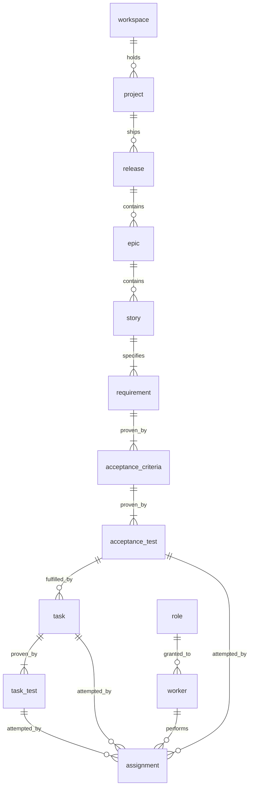

# Relationships

| from | to | cardinality |
|---|---|---|
| workspace | project | one to many |
| project | release | one to many |
| release | epic | one to many |
| epic | story | one to many |
| story | requirement | one to **one or many** — a story that specifies nothing cannot be delivered |
| requirement | acceptance_criteria | one to **one or many** — a requirement with no criteria can never be met |
| acceptance_criteria | acceptance_test | one to **one or many** — a criteria with no test is unprovable, and silently so |
| acceptance_test | task | one to many |
| task | task_test | one to **one or many** — a task must say how it proves itself |
| task | assignment | one to many — one per attempt, and the task survives a failed one |
| acceptance_test | assignment | one to many — same, for a test somebody has to perform |
| task_test | assignment | one to many |
| role | worker | one to many |
| worker | assignment | one worker per assignment; a worker holds many over time |

**Never many to many.** A child belongs to exactly one parent, so a failing
acceptance_test names exactly one unmet acceptance_criteria, which names exactly one
unsatisfied requirement.

**A task has no task.** Work that needs breaking down is several tasks under the same
acceptance_criteria, never a task with children. A task with children would be done when
its children are done, which makes it a container rather than work.

**Voice follows direction.** Active where the parent owns the child — *holds*, *contains*,
*specifies*. Passive where the child does something to the parent — a requirement does not
prove itself, it is *proven_by* its criteria; a criteria is *fulfilled_by* the tasks that
satisfy it.

**A task's parent is the test it was created to attack — its intent, not its effect.** A
task may turn several tests green; only one is its parent, and the rest are measured by the
tests rather than claimed by an edge.

**Work shared between tests gets its own criteria.** Infrastructure several tests rely on —
a verifier, a fixture, a harness — has value of its own, so it is stated as a criteria with
its own test rather than parented arbitrarily.

**Tests exist before the tasks that attack them.** A task cannot be created without a test
to attack, which is the discipline rather than a restriction to route around.
