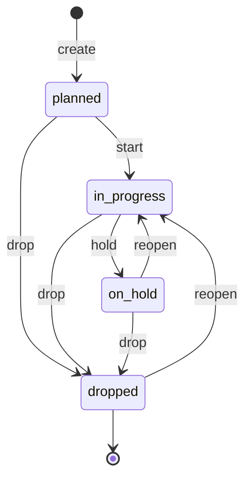
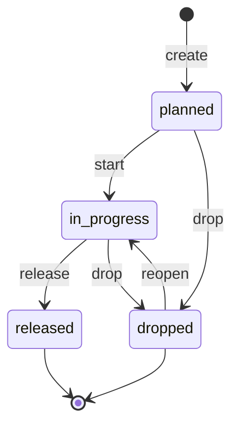
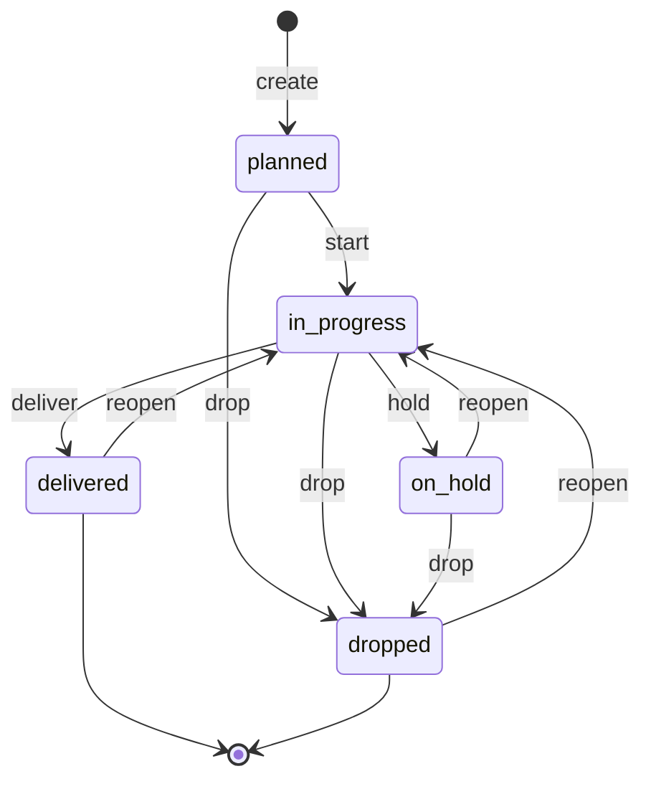
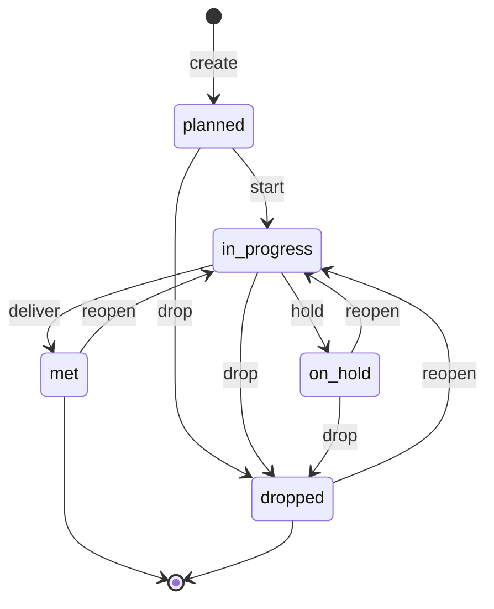
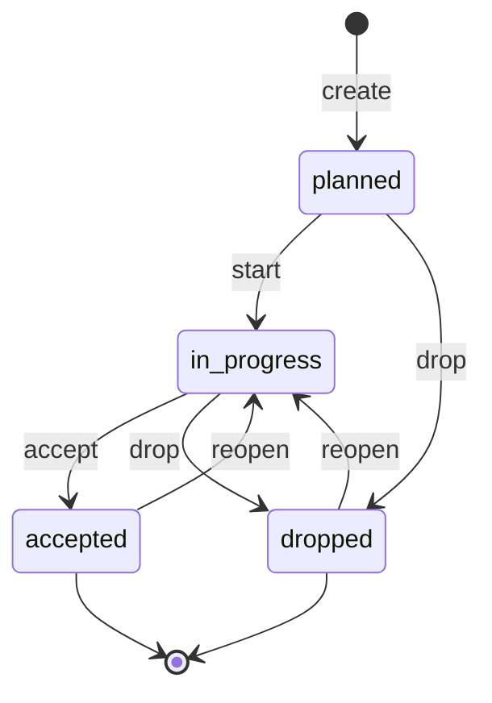
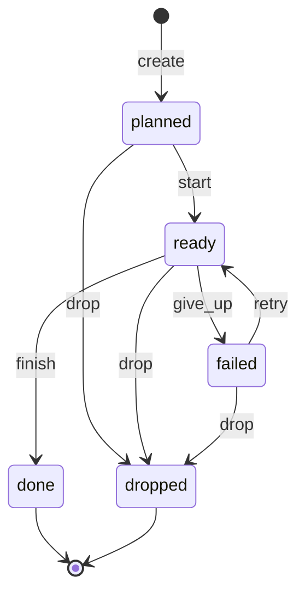
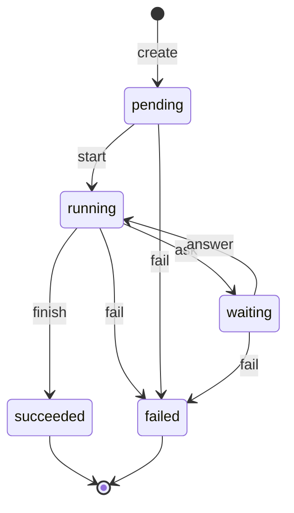
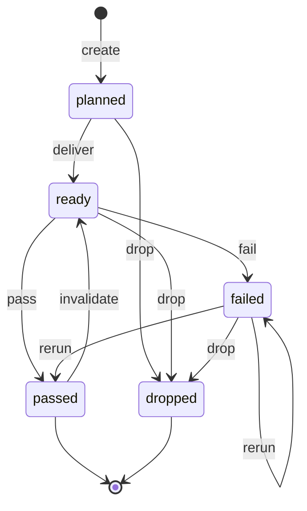

# Lifecycles

One state machine per entity. A state exists only where behaviour depends on it.

## workspace

No state. Nothing about a workspace behaves differently at different times — it holds
projects, and the projects carry the states.

## project

| state | means | constraint to enter |
|---|---|---|
| **planned** | named, with its releases still being chosen; nothing has started | none |
| **in_progress** | work is under way | none |
| **on_hold** | somebody stopped it on purpose; the work stays visible | none |
| **dropped** | no longer worked on | none |

## release

| state | means | constraint to enter |
|---|---|---|
| **planned** | the version is named and its epics are still being chosen | none |
| **in_progress** | the epic set is settled and work is under way | none |
| **released** | shipped | **every epic is `delivered` or `dropped`** |
| **dropped** | this version will not ship | **every epic is `dropped`** |

## epic

| state | means | constraint to enter |
|---|---|---|
| **planned** | named, with its stories still being chosen; nothing has started | none |
| **in_progress** | work is under way | none |
| **on_hold** | parked while other epics in the release continue | none |
| **delivered** | every story in it is delivered | **every story is `delivered` or `dropped`** |
| **dropped** | given up on | **every story is `dropped`** |

## story

| state | means | constraint to enter |
|---|---|---|
| **planned** | named, with its requirements still being written; nothing has started | none |
| **in_progress** | work is under way | none |
| **on_hold** | parked while other stories in the epic continue | none |
| **delivered** | the capability is usable | **every requirement is `met` or `dropped`** |
| **dropped** | given up on | **every requirement is `dropped`** |

## requirement

| state | means | constraint to enter |
|---|---|---|
| **planned** | stated, with its acceptance_criteria still being written; nothing has started | none |
| **in_progress** | work is under way | none |
| **on_hold** | parked while other requirements in the story continue | none |
| **met** | what must be true is true | **every acceptance_criteria is `accepted` or `dropped`** |
| **dropped** | given up on | **every acceptance_criteria is `dropped`** |

## acceptance_criteria

| state | means | constraint to enter |
|---|---|---|
| **planned** | stated, with its acceptance_tests still being written; nothing has started | none |
| **in_progress** | work is under way | none |
| **accepted** | the condition holds | **every acceptance_test is `passed` or `dropped`** |
| **dropped** | given up on | none |

## task

A task is one piece of work. It does not run — an assignment does — so its states are about
the work, not about any attempt at it.

| state | means | constraint to enter |
|---|---|---|
| **planned** | created, not started | none |
| **ready** | may be attempted | **a scope, a role, and at least one task_test `ready`** |
| **done** | its own work is complete | **every task_test is `passed` or `dropped`** |
| **failed** | no further attempt will be made | **`max_retry` reached, or a person said so** |
| **dropped** | given up on | none |

A task sits in `ready` while assignments come and go under it. One failed assignment does
not fail the task; `max_retry` does.

## assignment

One worker's promise to complete one objective. It is the only entity that runs, and the
only one whose state somebody else writes: **spec** is set when it is created and never
changes, **status** is overwritten by the runner on every tick.

| spec — written once | |
|---|---|
| `objective` | the task, acceptance_test or task_test it promises |
| `worker` | the role, and the kind of worker that role runs as |
| `scope` | files it may change, tools it may run |
| `budget` | what it may spend |
| `worktree` | where it works |

| phase | means | constraint to enter |
|---|---|---|
| **pending** | created, no worker running yet | none |
| **running** | a session is alive and reporting | none |
| **waiting** | it asked a person something and stopped | **a kind** |
| **succeeded** | the objective was met | none |
| **failed** | the attempt ended without getting there | **a reason** |

| kind | the worker asked for | may be answered by |
|---|---|---|
| `approval` | agreement to something | the operator |
| `input` | information it does not have | anyone who has it |
| `option` | a choice between alternatives it has named | anyone who has it |

| reason | the attempt ended because |
|---|---|
| `budget_exceeded` | it ran out of what it was given to spend |
| `timeout` | it ran longer than it was allowed |
| `lost` | it stopped reporting and the deadline passed |
| `out_of_scope` | it tried to change something its scope did not reach |
| `other` | anything the list above does not yet name |

Five phases, and every explanation lives in a field beside them rather than in a phase of
its own. A retry is not a transition: it is **a new assignment**, and the failed one stays
on the record.

## acceptance_test

| state | means | constraint to enter |
|---|---|---|
| **planned** | declared by its acceptance_criteria, not written | none |
| **ready** | written and runnable, never yet judged | **the artefact resolves** |
| **passed** | run, and the claim held | none |
| **failed** | run, and the claim did not hold | none |
| **dropped** | no longer needed | none |

## task_test

| state | means | constraint to enter |
|---|---|---|
| **planned** | declared, not written | none |
| **ready** | written and runnable, never yet judged | **the artefact resolves** |
| **passed** | run, and the claim held | none |
| **failed** | run, and the claim did not hold | none |
| **dropped** | no longer needed | none |

## role

No state. A role is a definition — which files may be changed, which tools may be run — and
there is no act on it that is not an edit.

## worker

No state, for now. What looked like one turned out to be two things wearing one name: the
worker, and the worker's instance — a session actually running. Enrolling, suspending and
retiring belong to one of them, and being busy to the other. Until that split is made, a
state machine here would describe neither.
