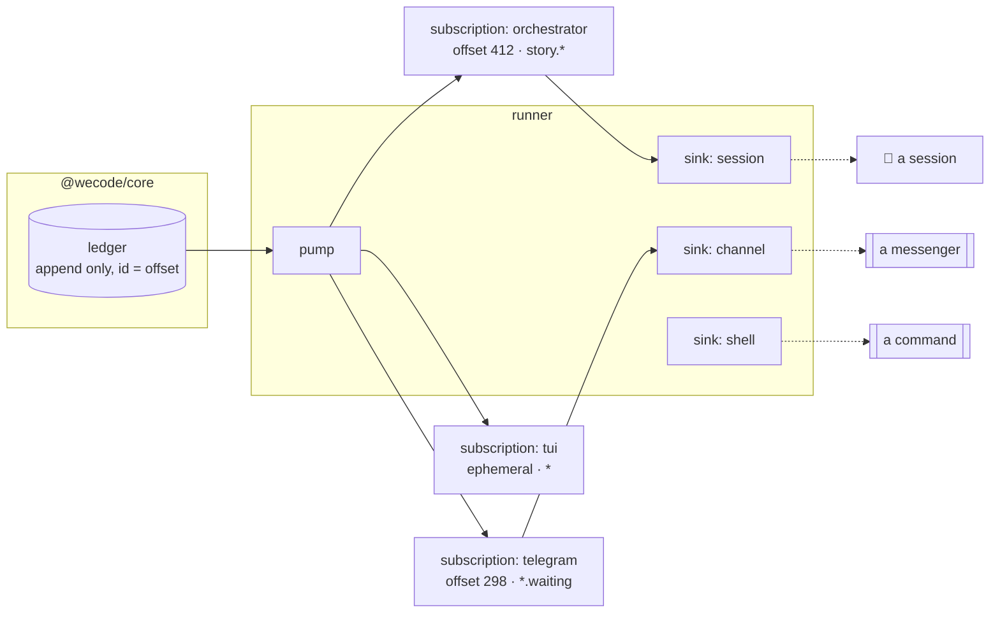

# Subscriptions

How something learns that something happened, at its own pace, without wecode learning what
that something is.

## The ledger is already the topic

Every transition is appended to `ledger` with a monotonic id and nothing is ever updated.
That is a log, and the ids are offsets. Nothing new has to be stored to have a topic — what
is missing is **a subscriber that remembers where it got to**.



## A subscription

| field | |
|---|---|
| `name` | `orchestrator`, `telegram`. Unique, and the thing you unsubscribe by |
| `filter` | `story.delivered`, `*.waiting`, `task.*`, `*` — matched on what the ledger wrote |
| `sink` | which adapter delivers it |
| `config` | that sink's own settings: a session id, a command line, a chat |
| `offset` | the last ledger id it has seen. **This is the whole idea** |
| `lag` | derived: the newest ledger id minus its offset |
| `last_error` | why it is not advancing, if it is not |

## How delivery works

| rule | why |
|---|---|
| **each subscription advances its own offset** | a dead one resumes where it stopped. One global cursor means whoever was down lost the morning |
| **the offset advances only after the sink accepts** | at-least-once. A sink that is down leaves the offset where it is and the events wait |
| **a failing sink backs off, it does not spin** | doubling to a cap, with `last_error` on the record |
| **duplicates are possible, losses are not** | a crash between delivering and advancing re-delivers. A sink must tolerate that, and saying so is cheaper than two-phase commit |
| **a subscription is never required** | with none, wecode behaves exactly as it does now |

## Lag is a board row

A subscription that stops advancing is the same kind of fact as a task nothing will pick up:
it is derived, it has an age, and it belongs beside the other things that have stopped.

```
SUBSCRIPTIONS
  orchestrator   story.*      lag 0     ok
  telegram       *.waiting    lag 114   sink failed: connect ECONNREFUSED · 31m
```

## The sinks

Checked Sep 2026. Above a sink there are events; below it there is somebody else's CLI.

| sink | reaches a running session | how |
|---|---|---|
| **shell** | — | runs a command with the event in the environment. The universal one |
| **codex** | **yes** | `codex queue <session> "<text>"` |
| **claude-code** | no | `claude --resume <id> -p "<text>"` opens a fresh headless turn. An interactive session cannot be pushed into — it must have asked, which is what `wecode wait` is |
| **pi** | no | `pi --session-id <id> "<text>"` |
| **channel** | — | the MCP messenger from `01`, for a person rather than an agent |

**Only Codex can interrupt.** A sink that pretended otherwise would drop messages silently.

## The commands

```bash
wecode subscribe orchestrator --filter 'story.*' --sink codex --session $ID
wecode subscriptions                  # name, filter, sink, offset, lag, last error
wecode unsubscribe orchestrator
wecode watch                          # an ephemeral subscription that dies with the terminal
```

`wecode watch` is the same mechanism with no row: it reads from the newest id and keeps no
offset, which is why closing it loses nothing — there was nothing to lose.

## What this is not

Not a queue, not a broker, not Kafka. One reader per subscription, polling a table that was
already being written, on the tick that was already happening. The only thing borrowed is
the part that matters: **the consumer owns its position, so being away is survivable.**
