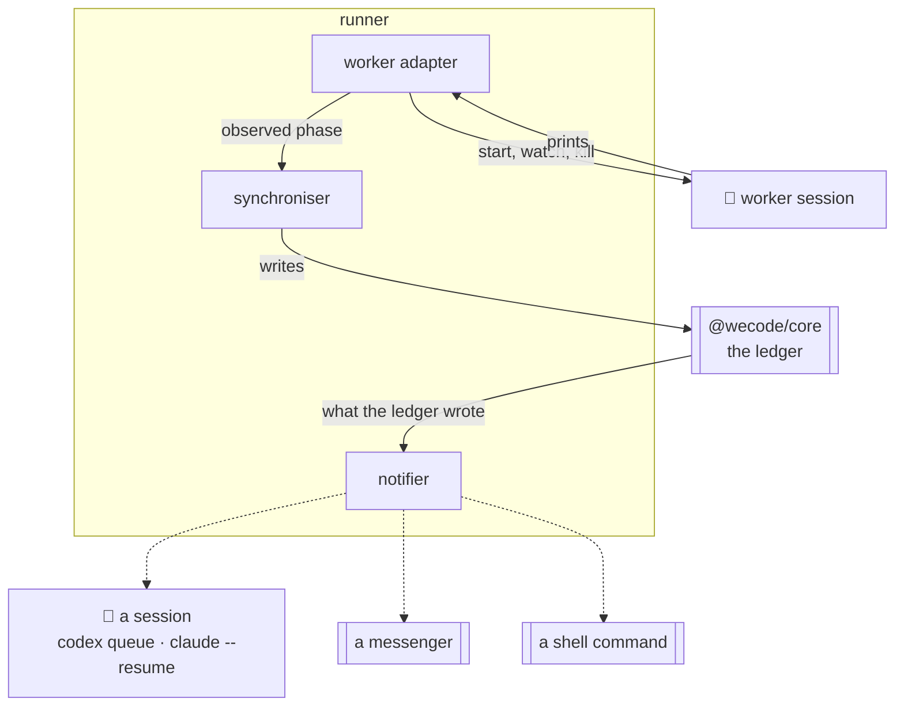

# Notifiers

How something learns that something happened, without wecode learning what that something
is.

wecode already knows every event: the ledger is append-only and `wecode watch` streams it.
What is missing is the other half — reaching an agent or a person who is not asking.

## The shape



**Two ports, pointed opposite ways.** The worker adapter reaches a worker so work can
happen; the notifier reaches a watcher so somebody learns it did. Above either there are
events; below them there are flags, a session id, or a command line.

## The port

One per way of reaching somebody, exactly as the worker adapter is one per kind of worker.

```
notify(event) -> void
```

| field | |
|---|---|
| `entity`, `id` | `story`, 103 |
| `verb`, `from`, `to` | `deliver`, `in_progress`, `delivered` |
| `actor` | who did it |
| `project`, `repo` | which project, and where it lives |

Above the notifier there are events. Below it there is a harness's own CLI, a messenger, or
a shell command. **Nothing above learns which.**

## The adapters

Checked Sep 2026.

| adapter | reaches a running session | how |
|---|---|---|
| **shell** | — | runs a configured command with the event in the environment. The universal one: every harness can be reached by *some* command |
| **codex** | **yes** | `codex queue <session> "<text>"` puts a message into a session that is already running |
| **claude-code** | no | `claude --resume <id> -p "<text>"` opens a fresh headless turn on that session. An interactive session cannot be pushed into — it must have asked, which is what `wecode wait` is for |
| **pi** | no | `pi --session-id <id> "<text>"` |
| **channel** | — | the MCP messenger from `01`, for a person rather than an agent |

**Only Codex can interrupt.** For the others the honest shape is: the agent asks (`wecode
wait story 103 &`, and the command finishing is the notification), or a new turn is opened
against a session id. A notifier that pretended otherwise would silently drop messages.

## The config

```yaml
# config/hooks.yaml, in the workspace — events are the workspace's, like the budget
on:
  story.delivered:
    - notifier: codex
      session: ${WECODE_ORCHESTRATOR_SESSION}
      text: "story #${id} delivered — land it"
  assignment.waiting:
    - notifier: shell
      run: notify-send "wecode needs you on #${id}"
  task.failed:
    - notifier: channel
      text: "task #${id} failed: ${reason}"
```

| key | |
|---|---|
| `on.<entity>.<to_state>` | the event, matched on what the ledger wrote |
| `notifier` | which adapter |
| everything else | that adapter's own settings |

An unknown notifier name is a config error at load, not a message that vanishes.

## Rules

| | |
|---|---|
| **a notifier never blocks a tick** | it is fired and forgotten. A messenger that is down must not stop work |
| **a failure is recorded, not retried** | the ledger is the record; a notification is a courtesy. Retrying a nudge is how you get twenty of them |
| **at most once per event** | the runner keeps the last ledger id it notified for, so a restart does not replay the morning |
| **nothing is required** | with no hooks.yaml, wecode behaves exactly as it does now |
