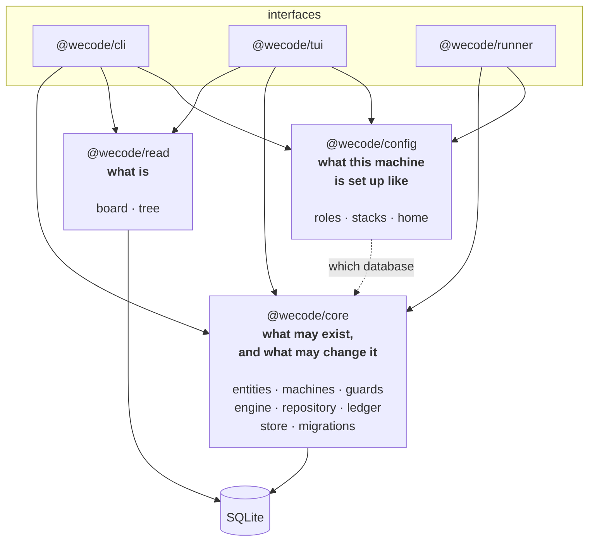

# The package split

A proposal. Nothing has moved.

`@wecode/core` is three layers in one box — the model, the record, the reads, and a
filesystem config loader besides. No drawing of it reads well, because three layers cannot
be drawn as one, and no client uses all of it.

## Where this shape comes from

| system | what its core owns | what it deliberately does not |
|---|---|---|
| **Kubernetes** apiserver | types, validation, admission, the record in etcd | behaviour — that is controllers, in other binaries. Reads go through informer caches, never etcd |
| **Temporal** history service | an append-only event history, state machines over it, admission on every transition | execution — workers poll task queues and report back |
| **Odoo** ORM | models, fields, constraints, the registry | presentation, which is data |

All three agree: **the core owns what may exist and what may change it. Anything with a
clock lives outside. Reads do not go through the gate.**

Temporal is the closest analogue wecode has — long-running work, workers that die
mid-task, an append-only history as the only truth. It has run production workflows at
Uber, Netflix, Stripe and Coinbase since 2019, which is why its shape is worth borrowing
even though its machinery — sharding, consensus, a visibility store — is for a problem
wecode does not have.

## The proposal

| package | one sentence | depends on |
|---|---|---|
| **`@wecode/core`** | what may exist, and what may change it | SQLite |
| **`@wecode/read`** | what is, grouped for a person | SQLite |
| **`@wecode/config`** | what this machine is set up like | the filesystem |

Three sentences, three packages. The test that the line is in the right place: **`read`
never imports `core`**, and `core` never opens a YAML file.

## Why `read` is separate, not a convenience

Commands go through the gate; queries do not. That is CQRS, and it is deliberate here for a
plain reason: the board is the record grouped, so it cannot be wrong about anything the
record is right about. Kubernetes draws the same line — a lister is not the apiserver.

## What each client actually uses

| client | core | read | config |
|---|---|---|---|
| `cli` | ✓ | ✓ | ✓ |
| `tui` | ✓ for the `a` key | ✓ | ✓ for which workspace |
| `runner` | ✓ | — | ✓ for roles and the budget |

A package that no client uses the whole of is more than one package. That is the argument,
and it is the only one that matters.

## The cost

| | |
|---|---|
| three `package.json` and three `tsconfig.json` | and an import graph that has to stay acyclic |
| every import in four packages rewritten | mechanical, and a compiler error if it is wrong |
| one release becomes three | they version together anyway |

## The test it worked

`@wecode/core` compiles with **no dependency on `read` or `config`**, and `read` compiles
with no dependency on `core`. If either cannot, the line is in the wrong place.
