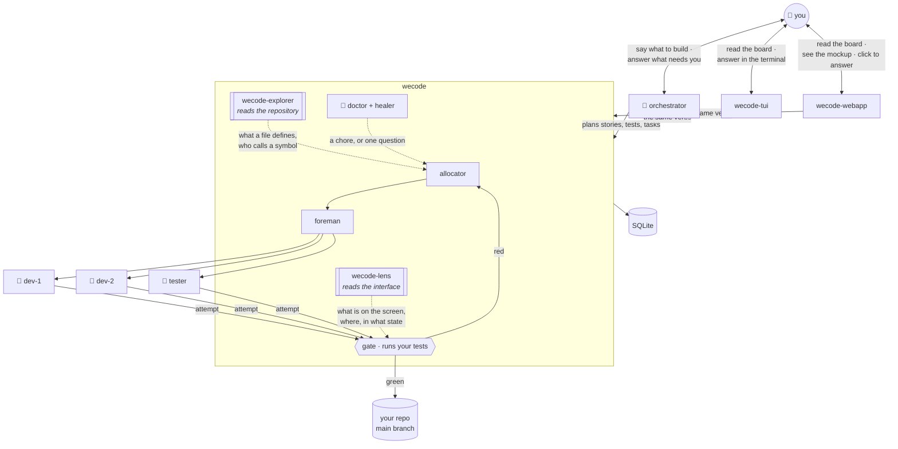
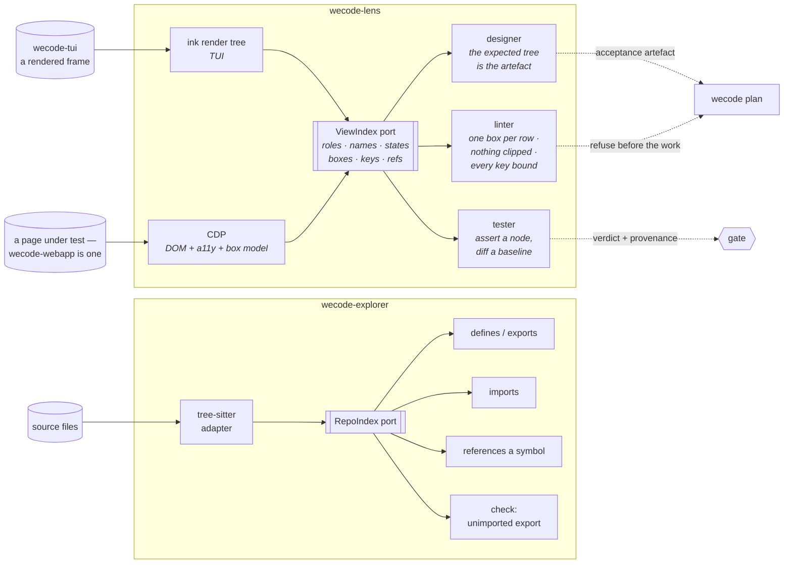

# UI

Reading an interface as structure, not as a picture.

**On release 0.0.5.** Not started; drawn before implementation so it is not invented twice.

## Why

Six interface defects reached the base this week and every one was caught by a person
looking at a screenshot: the running panel folded away, delivered and failed in one box,
`open` holding two meanings, the id clipped off the right edge, the fold marker floating
away from its row, a detail page with three fields. Each had a green test beside it.

The tests were green because they assert **strings**. `expect(lines.join("\n")).toContain("Running")`
passes whether that word is a panel title, a row's state, or a word inside a description.
Nothing in the suite could state *which box a row is in*, because nothing in the code can
say what a box is once it has been drawn.

An agent has the same problem, worse. It cannot look. Asked whether the board is right it
re-reads the source and reasons about what the code *should* draw — which is how a screen
gets declared finished twice in one night while the thing on the screen is wrong.

## The idea

`wecode-explorer` reads the repository as structure: what a file defines, who calls a
symbol, what imports what. It replaced *grep and hope* with a question the index answers.

`wecode-lens` is the same move, pointed at the interface. A rendered screen becomes a tree of
nodes with roles, names, states and boxes — and then a test asserts a node, a linter walks
the tree, and an agent reads a screen in a few hundred tokens instead of not at all.

| | explorer | ui |
|---|---|---|
| reads | source files | a rendered surface |
| through | tree-sitter | the render tree (TUI) · CDP (web) |
| answers | what does this file define, who calls this | what is on this screen, where, in what state |
| serves | scope proposals, the unimported-export check | UI tests, the view linter, design capture |

**Two halves, one index.** The designer declares what a screen should hold; the tester reads
what it does hold; both speak the same tree. A design is the expected tree and an assertion
is a query over the observed one — so the thing that is designed is the thing that is proved,
rather than two descriptions that drift.

## The tree

One shape for every surface, because a test that reads a TUI and a test that reads a web
page should differ in the adapter, not in what an assertion looks like.

```
screen board
  box "Needs you"  key=n  rows=0  at=(0,0 78x4)   empty="nothing waits on you"
    ·
  box "Running"    key=r  rows=2  at=(0,5 78x6)
    row #843  entity=assignment  state=running   worker=dev-4  age=1m
    row #841  entity=assignment  state=running   worker=dev-9  age=9m
  box "Cooking"    key=c  rows=21 at=(0,12 78x14)
    row #357  entity=task  state=failed  why="3 of 3 attempts"
```

| field | is | why it is there |
|---|---|---|
| `role` | box · row · cell · field · control | the vocabulary an assertion names |
| `name` | the accessible name, or the title | what a person would call it |
| `state` | the entity's state, where a row has one | so a colour is never the only carrier |
| `box` | x, y, width, height in cells or pixels | clipping, overlap and order are geometry, not prose |
| `key` | the keystroke that reaches it | a screen nobody can reach is a defect |
| `ref` | the entity id behind the row | joins the screen back to the ledger |

**Geometry is in the tree on purpose.** *The id is clipped off the right edge* is not a
string fact; it is a box wider than its container. So is *two panels overlap* and *this row
is off-screen*. A tree without boxes cannot state the defects that actually happen.

## Level 1 — where it sits



**Two clients, one core.** `wecode-tui` and `wecode-webapp` are siblings at level 1: each reads
`board()` and calls the same verbs, and neither holds a rule of its own. They share the
*content* of every screen (`design.yaml` `screens:`) and differ only in a `renderers:` block —
so `wecode-lens` gates both with one file, the ink adapter reading the terminal and the CDP
adapter reading the page.

Two indexes, one shape: the explorer answers questions about the **code**, `wecode-lens`
answers them about the **screen**. The explorer feeds the allocator, because a scope is a
claim about source. The UI index feeds the gate, because a screen is a claim about output.

## Level 2 — inside the two indexes



Same architecture both sides: **one port, replaceable adapters, queries and checks on top**.
The designer and the tester are not two tools — they are two directions through one index,
which is what stops a design and its proof from drifting apart.

## Two adapters, one port

```
        wecode-lens
   ┌─────────────────┐
   │   the tree      │   roles · names · states · boxes · keys
   └────────┬────────┘
     ┌──────┴───────┐
   ink/TUI         CDP
  render tree    DOM + a11y + layout
```

| surface | adapter | source |
|---|---|---|
| TUI | the ink render tree, plus the frame buffer for geometry | already in process; no screenshot, no pty needed for structure |
| web | Chrome DevTools Protocol — `DOM.getDocument`, `Accessibility.getFullAXTree`, `DOM.getBoxModel` | the same three calls Playwright's accessibility snapshot rests on |
| anything else | an adapter that answers the port | the port is the only coupling, as with the repo index |

**The concept is borrowed, the code is ours.** Two projects named viewgraph hold the halves:
one captures a live page as agent-ready structure and generates tests from it, reporting
97% fewer tokens per task than a screenshot; the other declares the UI as a graph and says
*the graph is the spec* — the human declares what should be observable and that declaration
is the acceptance criteria. Playwright MCP and computer-use's `read_page` both already hand
a model the accessibility tree rather than pixels. We take the idea and own the code, the
same decision as `node:sqlite` over an ORM.

## Prior art — do not invent a vocabulary

Describing an interface as text is a solved problem five times over. The table is what each
community settled on, and what is worth taking.

| convention | who uses it, in anger | shape | take |
|---|---|---|---|
| **ARIA accessibility tree** (W3C) | every screen reader, every browser | `role` + accessible `name` + state, a subset of the DOM | **the vocabulary.** roles and names are the one naming scheme both a blind user and a model already share |
| **Playwright aria snapshots** | Playwright test suites; Playwright MCP serves this to agents | indented YAML: `- heading "Title" [level=1]`, partial matching, `--update-snapshots` | **the serialization.** readable, diffable in git, already has a baseline-update story |
| **Android UIAutomator dump** | Appium, every mobile QA team | XML of the view hierarchy with `resource-id`, `bounds` | **bounds.** mobile testing has carried geometry in the tree for fifteen years |
| **Compose semantics tree** | Android UI tests | a tree built *alongside* the UI; `testTag` surfaces as `resource-id` | **the second tree.** the app declares semantics; the test reads them |
| **Figma node tree** | designers, daily | `FrameNode` / `TextNode`, `layoutMode`, `HUG` / `FILL`, padding, `layoutAlign` | **layout intent.** the designer's own words for what should stretch and what should hug |
| **PlantUML Salt** | wireframes in docs and tickets | ASCII wireframes, version-controlled, diffable | **the designer's input form.** a sketch a person can write and a machine can parse |
| **Design Tokens (DTCG)** | design systems across the industry | JSON of named colour, space, type | **the style axis**, kept out of the tree — a token name, never a hex |
| **BrowserGym / WebArena** | web-agent research and benchmarks | `[id] role name value`, indentation, extracted over CDP | **the id.** a stable handle per node is what makes an action addressable |

Two things every one of them agrees on, and we should not argue with:

| | |
|---|---|
| **role + name, not tag + class** | a `<div class="btn-primary">` says nothing; `button "Approve"` says what it is and what it is for. This is why the accessibility tree — designed for people who cannot see — turned out to be the right format for a model that cannot see either |
| **one id per node** | an assertion, an action and a diff all need to point at the same thing twice |

And one thing only the mobile and design worlds got right: **geometry belongs in the tree.**
ARIA has no box. UIAutomator has `bounds`; Figma has `x, y, width, height` plus hug/fill
intent. Four of this week's six defects were geometric — clipped column, floating marker,
folded-away panel, overlapping boxes — and a roles-and-names tree cannot state any of them.

### What wecode-lens adopts

```yaml
# a wecode-lens capture: Playwright's shape, ARIA's vocabulary, UIAutomator's bounds
- box "Running" [key=r] [at=0,5 78x6]
  - row "give running its own panel" [ref=#424] [state=running] [at=1,7 76x1]
    - cell "dev-10"  [at=52,7 8x1]
    - cell "0m"      [at=61,7 4x1]
  - row "…" [clipped]
```

| axis | borrowed from | why not ours |
|---|---|---|
| vocabulary | ARIA roles + accessible name | a standard both the a11y stack and every agent harness already speak |
| serialization | Playwright aria-snapshot YAML | indentation, partial match, update-the-baseline: all three already designed |
| geometry | UIAutomator `bounds`, Figma x/y/w/h | the only way to state clipping and overlap |
| layout intent | Figma `HUG` / `FILL` / padding | the designer's words, so a design and its proof read alike |
| style | DTCG token names | a hex in a test is a test that fails on a theme change |
| node id | BrowserGym's `[id]`, ours being the entity ref | joins the screen back to the ledger |

**Nothing here is imported.** These are conventions, not dependencies — the same call as
`node:sqlite` over an ORM. The cost of inventing our own would be a format no agent has
ever seen; the cost of adopting theirs is nil, and every model already reads it.

## What it is for

| | |
|---|---|
| **assert a screen** | `ui.box("Running").rows` — not a substring of a joined frame |
| **lint a view** | every row in exactly one box · every panel has a filter · every filter reaches a panel · every key bound once · nothing clipped · no unreachable screen |
| **capture a design** | the expected tree, written before the code, is the acceptance artefact |
| **diff against a baseline** | what changed structurally since the last accepted capture — *Running disappeared* is a missing node, found the tick it happens |
| **let an agent see** | a few hundred tokens of tree instead of a screenshot it cannot read |

## Seeing it — one file, two readers

A design a person cannot look at will not be reviewed, and a design a model cannot parse
will not be enforced. The same file has to serve both, or they drift the way a Figma frame
and its implementation always drift.

**Geometry makes this trivial.** Because every node carries `at=x,y w×h`, drawing the tree
is a projection — rectangles, labels, done. No layout engine, no guessing: the wireframe is
what the tree literally says. That is not true of a roles-and-names tree, which has to be
*laid out* by something that invents positions the real screen may not have.

```
the one artefact                 read two ways

  box "Running" [at=0,5 78x6]    ┌─ Running (2) ──────────────────────┐
    row #843 [at=1,7 76x1]  ──▶  │ #843  give running its own panel   │
    row #841 [at=1,8 76x1]       │ #841  close the gap on the marker  │
                                 └────────────────────────────────────┘
        ▲                                        ▲
   the tester asserts                    the designer reviews
```

| direction | what it is | who reads it |
|---|---|---|
| **tree → wireframe** | boxes drawn at their stated coordinates, SVG for the web, a frame for the TUI | you, in a PR or a ticket |
| **tree → tree** | the diff: a missing node, a moved box, a changed state | the gate |
| **capture + screenshot** | the boxes drawn *over* a real screenshot, each labelled with its ref | you, when you disbelieve the capture |

The third is Set-of-Marks, the trick web-agent research uses to put a model and a person in
front of the same evidence; here it runs the other way, to let a person audit what the
machine claims it saw.

### Prior art for the renderer

| | what it does | take |
|---|---|---|
| **PlantUML Salt** | text → rendered wireframe image, diffable source, used in docs and tickets for years | proof the loop works, and a plausible *input* syntax for a person sketching |
| **Wire-DSL** | `.wire` text → parser → AST → IR → layout engine → **SVG / PNG / PDF** | the exact pipeline, already built once by someone else; ours skips the layout engine because the tree has coordinates |
| **wired-elements** | hand-drawn SVG components, Balsamiq look | the lo-fi register: a wireframe that looks unfinished gets reviewed as structure, not as visual design |
| **Chrome DevTools a11y pane**, **Playwright's Aria snapshot tab**, **a11y tree visualizers** | render the accessibility tree for a person to inspect, side by side with the page | the viewer already exists for the web half; the convention is proven readable |
| **Excalidraw / Figma** | the picture is the source | the thing we are deliberately *not* doing — a picture cannot be asserted |

**So: do not write a renderer, write a projector.** Under a hundred lines to SVG, because
the hard parts — what is on the screen, where, how big — were decided when the tree was
captured. Every tool above had to invent positions; we read them.

### What it buys, concretely

Tonight's four-panel board would have been reviewed as a wireframe *before* the work
started: seven boxes drawn from `views.yaml`, you look at it for three seconds and say
"where is Running". Instead it was reviewed as a screenshot, after landing, twice.

## What this is not

| | |
|---|---|
| **not a screenshot tool.** A picture is for a person; the tree is what the machine judges |
| **not a browser driver.** It reads a surface someone else drives — playwright, ink, a pty |
| **not a component library.** It describes interfaces; it does not draw them |
| **not pixel-diffing.** Two runs differing by a font hint is noise; a missing box is not |

## Open

| question | recommendation |
|---|---|
| does the designer write the tree by hand | no — write the expectation as a query, keep the full tree as the captured artefact |
| where does the baseline live | beside the acceptance test, as its provenance: a verdict names the tree it was taken against |
| TUI geometry from ink or from the frame | the frame, measured once per render: it is what the eye gets |

## Leans on

W3C WAI-ARIA's accessibility tree — *a tree of accessible objects that represents the
structure of the user interface* — the standing answer to "what is on this screen" and the
reason it collapses thousands of DOM nodes to the meaningful set. Reflexion models, again:
declare the expected structure, map it to the observed, compute convergence and divergence.
Parnas: the boundary is the decision, so the port is the coupling and CDP is an adapter.
