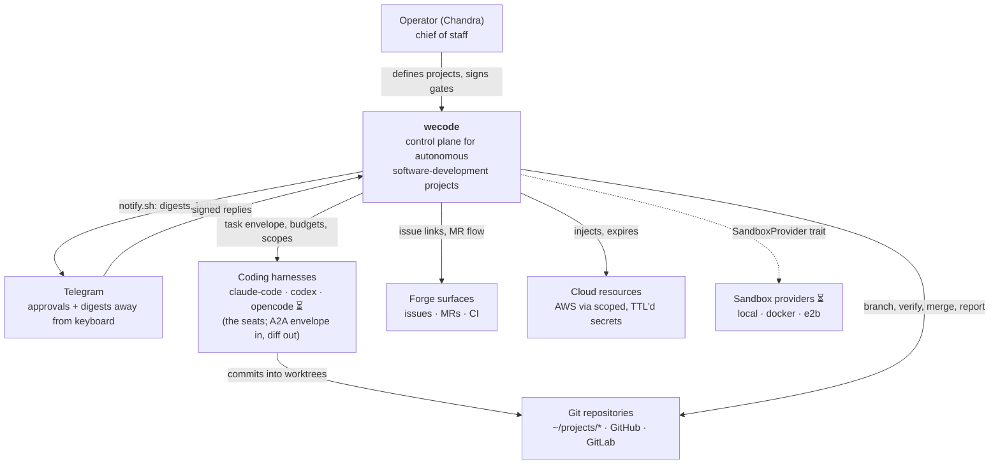
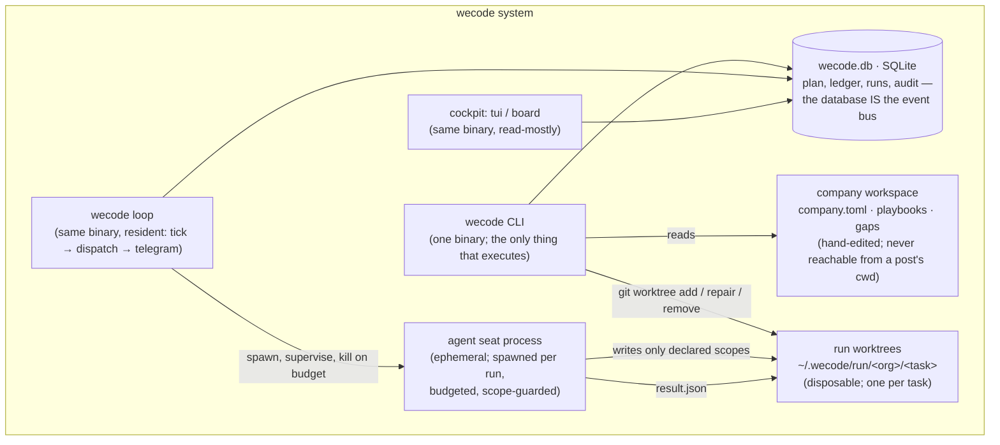

# C4 — the north star map

Levels 1 and 2, per Simon Brown's C4. L3 (components) is the crate table below —
the `components` task formalizes it; L4 is the code and is never drawn by hand.
Every box here exists today; planned boxes are marked ⏳.

## L1 · System context

The boundary sentence (maturity-roadmap.md): wecode consumes harnesses, sandboxes,
forges and clouds; it becomes none of them.

## L2 · Containers

| Container | Runs as | Owns | Talks to |
|---|---|---|---|
| wecode CLI | invoked per command | admission, verify, merge, rollback | db, workspace, git |
| wecode loop | resident process | dispatch cadence, telegram channel | db, agent processes |
| cockpit (tui/board) | invoked | rendering only | db |
| wecode.db | SQLite file | all state; every event | everyone (the bus) |
| company workspace | directory | roles, posts, invariants, playbooks | read by CLI only |
| run worktree | git worktree | one task's working copy | agent, verify |
| agent seat | ephemeral child | nothing durable | its worktree only |

## L3 · Components (the crates, ordered by dependency)

| Crate | Hides (Parnas) |
|---|---|
| core | pure types; admission's defect calculus — no I/O, no serde |
| gov | the Broker: authorization as a pure function of its inputs |
| org | parsing the hand-edited workspace |
| store | SQLite; how events persist |
| cli | that anything executes at all |

One rule keeps L2 honest: **no arrow into wecode.db except through store, and no
process but the CLI binary family ever holds it open.**
