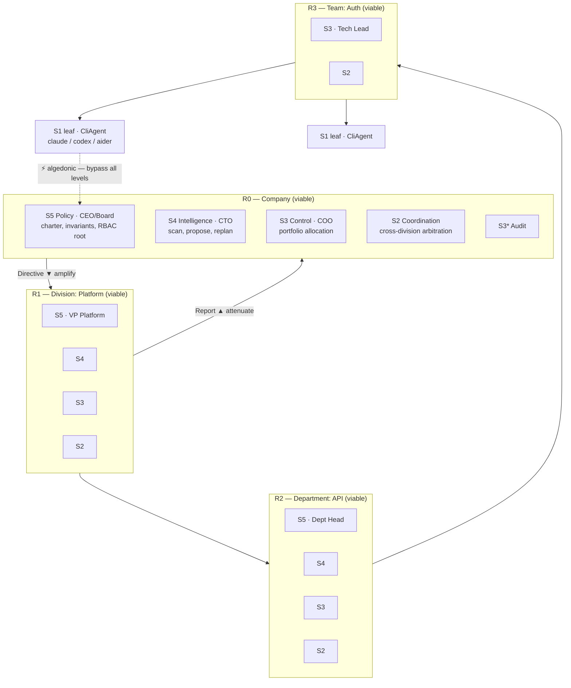
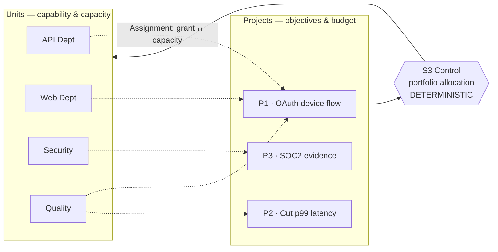

# wecode — Organizational Architecture

The company is the system. Agents are staff.

> **Reframe.** Earlier revisions of this design treated a *workflow* as the top
> object and an *agent* as the unit of interest. That is an SDLC tool. This
> document inverts it: the top object is an **organization** — recursive units
> with charters, roles, capabilities and budgets — and a workflow is merely how one
> unit discharges one assignment. Execution mechanics (CLI adapters, worktrees,
> diff scoping) move *below* this layer and are documented in
> [`architecture.md`](./architecture.md), which is now the **substrate**, not the
> architecture.

> ### 👤 Running this solo? Read §13 and §14 first.
>
> **Solo does not mean small — it means one human overseeing several agents as
> staff, where the scarce resource is your own attention.** §13 applies Ashby's Law
> to the operator: `max_parallel` should be a function of your attention, not your
> CPU cores, and the runtime throttles itself rather than flooding you.
> [§13.2](#132-what-actually-earns-its-place-at-n1) lists what to keep and drop;
> [§14](#14-the-oversight-interface) is the zoom interface — bird's-eye to leaf
> level, one shape per level — which at this profile *is* the product.

---

## 1. Grounding

This is not invented vocabulary. Three bodies of work, and what we take from each.

### 1.1 Viable System Model — Stafford Beer, *Brain of the Firm* (1972)

Organizational cybernetics. Any viable system necessarily has five subsystems,
and — the load-bearing claim — **every viable system contains and is contained in
viable systems**, all structurally identical (*homologous*). That recursion is
exactly the "company → division → department → team" structure you described, and
it is why VSM is the right frame rather than a metaphor we bolt on.

| VSM | Beer's name | Company role | wecode |
|---|---|---|---|
| **S1** | Operations | the people doing the work | `Unit` (recursive; leaves are agents) |
| **S2** | Coordination | release train, style guide, shared calendar | `Coordinator` — anti-oscillation |
| **S3** | Control / Optimization | Dept Head, EM — allocates budget & capacity | `Control` — the scheduler, promoted |
| **S3\*** | Audit | internal audit, QA sampling, code review | `Audit` — samples S1 *bypassing* S3 |
| **S4** | Development / Intelligence | CTO, R&D Head — scans outside, plans forward | `Intelligence` |
| **S5** | Policy / Valuation | CEO, board — identity, purpose, arbitration | `Policy` |

Plus two mechanisms most write-ups mention and then never implement:

- **Variety engineering** (Ashby's Law of Requisite Variety): a controller must
  command variety matching what it controls. Channels *attenuate* upward and
  *amplify* downward, deliberately. §7 makes this measurable.
- **Algedonic signals** (Gk. *pain/pleasure*): an emergency channel from S1
  **direct to S5**, bypassing every intermediate level. §6.3.

### 1.2 Organizational Control Layer — arXiv [2606.04306](https://arxiv.org/pdf/2606.04306)

Governance primitives for LLM agents — roles, permissions/scope, delegation,
escalation, audit, separation of duties — with one central claim we adopt wholesale:

> Enforce at the **execution boundary**, not in the prompt. Prompt-based guardrails
> are circumventable by construction; a middleware layer that validates every
> action against formal policy *before* it executes is not.

This retroactively justifies the strongest guardrail already in the substrate
(`DiffWithinScope`) and tells us to generalize it from paths to *all* capabilities:
spend, commands, network, merges, approvals. §5.

### 1.3 IMACS — arXiv [2607.25446](https://arxiv.org/abs/2607.25446)

Decouples three concerns most frameworks entangle: **who participates** (org
structure), **how they coordinate**, and **which algorithm combines outputs** —
into orthogonal, independently swappable layers. Encodes Belbin roles, Mintzberg
coordination and **RACI accountability** as executable configuration, and shows a
contextual-bandit meta-protocol selecting per task beats every fixed protocol.

The finding that actually constrains us:

> Accountability placement changes outcomes exactly when the protocol routes the
> deliverable through the accountable agent — and **the winning placement flips
> across model families.**

Consequence, adopted as decision D7: **the org chart is configuration, never
code.** Any hierarchy we ship is a guess that must be re-measured per model. RACI
becomes an explicit field (§4.3), not an implicit property of the tree.

### 1.4 Prior art: has anyone built this?

Yes — twice, in two disconnected lineages, and **the older one is better formalized
than what this document proposes.** Worth knowing before writing code, because it
changes what we can claim to be inventing.

#### A. VSM as software — thin, and everyone stops at S1

| Project | What it is | State |
|---|---|---|
| **Project Cybersyn** (Chile, 1971–73) | Beer's own VSM implementation for managing a national economy in near-real-time | historical; the origin |
| [`viable-systems`](https://viable-systems.github.io/vsm-docs/) | Elixir/OTP + Phoenix. **Full S1–S5**, algedonic channel, a novel "Temporal Variety Channel", "Z3N" (zero-trust/zero-knowledge/zero-latency) security | v0.1.0 **alpha**, self-described production-ready — treat that tension with care. General-purpose infrastructure, *not* agent-specific |
| [Multi-agent code review via VSM](https://www.eoinhurrell.com/posts/20250306-viable-systems-ai/) | Directly our domain. S1 = five specialist agents (Architect, Performance, Security, Quality, Docs) on LangGraph | **S1 built; S2–S5 conceptual only.** Reported blocker: context management |
| [Autonomous AI Organisations](https://medium.com/@fearney/applying-stafford-beers-viable-system-model-to-create-the-autonomous-ai-organisation-aaaed39b37e2) | VSM as a governance blueprint for agent enterprises | conceptual |

**The pattern is the finding: S1 gets built, S2–S5 stay prose.** Every VSM-labelled
agent project we found implements the operational layer — the part that is fun and
least novel — and describes the regulatory layers as future work. That is the
failure mode this design is most likely to repeat, and it is why §12 sequences
enforcement (O0) before intelligence (O6) rather than the reverse.

#### B. MAS organizational models — the deep prior art, and it predates LLMs by 20 years

Multi-agent systems research built exactly "function, role, RBAC, scope" in the
2000s, with more formal rigour than §4 of this document:

- **AGR** (Agent/Group/Role) → MadKit
- **MOISE+** — decomposes an organization into **structural** (roles, groups,
  links), **functional** (goals, missions), and **deontic** (permissions *and
  obligations*, time-constrained) dimensions. Playing a role means accepting its
  behavioural constraints.
- **OperA**, **TAEMS**, **ISLANDER / electronic institutions** (norms enforced
  computationally)
- Infrastructure: **JaCaMo** (Jason + CArtAgO + Moise), **S-MOISE+**, **ORA4MAS**

In JaCaMo the org specification is compiled into **NPL** (a normative programming
language) and enforced by **organizational artifacts** — enforcement living in the
environment rather than in the agent. That is the Organizational Control Layer's
"execution boundary" claim (§1.2), made and implemented fifteen years earlier.
**Reorganization** — dynamic adaptation of roles and groups — is our §7 structural
response under an older name.

Two things from this lineage change the design:

1. **Regimentation vs. enforcement.** The literature distinguishes *regimentation*
   (violation is technically impossible) from *enforcement* (violation is possible
   and sanctioned afterwards) and treats the choice as a **tradeoff**, not a
   settled answer. §5's Broker is pure regimentation. §1.2 led me to state that as
   obviously correct; it is not. See D2′ and §11.7.
2. **Deontic ≥ RBAC.** MOISE+ has *obligations* — a role that **must** achieve a
   mission within a time constraint — not merely permissions. §4 has no such
   concept, which means an idle unit currently violates nothing. Real gap; §11.8.

#### C. Holonic manufacturing — recursion running real factories for 25 years

**PROSA** is a reference architecture of *holons* (whole/part units, recursive and
self-similar): **order holons**, **product holons**, **resource holons**, plus
**staff holons** that supply expert knowledge to the others. Self-similarity is
explicitly valued for reconfigurability — homogeneous components lower integration
complexity.

Two independent confirmations here. PROSA's split of **order holon (demand)** from
**resource holon (supply)** arrives at our §8 project/unit matrix from a completely
different starting point; and "staff holons advising basic holons" is close to S4.
More importantly, this is *recursion in industrial production*, not theory — the
recursive/self-similar structure of D1 is proven engineering, whatever happens to
the rest of this document.

#### D. LLM-era frameworks — roles without authority

The claim in §1.5 below now has evidence rather than being an assertion:

| Framework | Roles? | Enforcement? |
|---|---|---|
| **CrewAI** | yes, role-based orchestration is its core abstraction | **no gate between an agent's decision and actual tool execution** — permissions are configurable yet bypassable at runtime; there is an open discussion requesting an auth/permission delegation layer |
| **MetaGPT / ChatDev** | yes — PM, Architect, Engineer | SOP/SDLC pipeline; roles are prompt content |
| **AutoGen / Semantic Kernel** | partial | strongest of the group: sandboxing, identity integration, policy controls |
| **Agno** | teams with modes | early-stage trust layer |

None combine recursive organization + enforced capabilities + an algedonic bypass.

#### Where that leaves us

**We are not inventing an organizational model. We are porting a mature one to a
new substrate.** MAS research has the formalism (MOISE+ deontics, regimentation,
reorganization); holonic manufacturing has proven the recursion; VSM supplies the
five functions and the algedonic channel; the novel part is only the substrate —
foreign coding-CLI subprocesses with filesystem write access, where the
enforcement points are worktrees, argv patterns and diffs rather than method calls
in a JVM.

That should *lower* our confidence in novelty and *raise* it in feasibility. It
also means the literature can be mined for the parts we got wrong, which §11.7 and
§11.8 now record.

### 1.5 What we explicitly reject

- **SDLC simulation.** MetaGPT/ChatDev-style "assign the LLM the role of Product
  Manager, then Architect, then Engineer" is a pipeline wearing an org costume.
  The roles there carry no authority, no budget, no enforcement — they are prompt
  flavour. Here a role is a set of *enforced capabilities* or it is nothing.
- **Vague cybernetics.** The best-known VSM→agents write-up is concrete about the
  S1–S5 labels and silent on the mechanics — no algedonic discussion at all, and
  "attenuates variety" with no definition. §6 and §7 are our own construction;
  they are engineering, not citation, and are flagged as unvalidated in §11.

---

## 2. The recursion



Every box except the leaves is a full viable system with its own S1–S5. That is
the whole point: **`Unit` is one type, used at every scale.** A department is not
a different kind of thing from a company; it is the same thing, smaller. Growing
the org is adding recursion depth, not adding classes.

Leaves are the only place real work happens — an `Agent` in the substrate sense
(§[architecture.md](./architecture.md) §4.3): a supervised coding-CLI subprocess in
a git worktree.

**Depth is not free.** Each non-leaf level adds channels, rollups and potentially
model calls. Default depth is **2** (Company → Team → agents); deeper only when
§7's variety condition forces a split. See D5.

---

## 3. Core types

```rust
// ---------- The one recursive type ----------
pub struct Unit {
    pub id: UnitId,
    pub name: String,                  // "Auth Team", "Platform Division"
    pub kind: UnitKind,
    pub parent: Option<UnitId>,        // None only for the company
    pub children: Vec<UnitId>,
    pub charter: Charter,              // its S5 — purpose and invariants
    pub roles: Vec<RoleId>,            // roles this unit holds
    pub grant: Grant,                  // capabilities, delegated from parent (§5.2)
    pub capacity: Capacity,            // what it can absorb per cycle (§7)
    pub systems: Option<Systems>,      // None ⇔ leaf
}

pub enum UnitKind {
    Company,
    Division,
    Department,
    Team,
    Post { agent: AgentId },           // a leaf: one seat, filled by one agent
}

/// Present at every non-leaf level. Same five functions at every scale.
pub struct Systems {
    pub coordination: Coordinator,     // S2
    pub control: Control,              // S3
    pub audit: Audit,                  // S3*
    pub intelligence: Intelligence,    // S4
    pub policy: Policy,                // S5
}

/// A unit's identity. Beer's S5, made into data.
pub struct Charter {
    pub purpose: String,
    /// Non-negotiable. Violation is an algedonic trigger (§6.3), not a retry.
    pub invariants: Vec<Invariant>,
    pub escalate_to: Option<UnitId>,   // usually parent; None ⇒ terminal (human)
    pub decision_rights: Vec<DecisionRight>,
}

pub enum Invariant {
    NeverTouch(Vec<Glob>),             // e.g. infra/prod/**, .github/workflows/**
    NeverRun(CommandPattern),          // e.g. `terraform apply`, `npm publish`
    RequireApproval { action: ActionKind, by: RoleId },
    MaxSpend(Budget),
    SeparationOfDuty { a: RoleId, b: RoleId },   // no unit may hold both
}
```

### 3.1 `Post` vs `Agent` — the seat/occupant split

`UnitKind::Post` is deliberate and mirrors how real orgs work: a **post** is a
seat in the org chart with a role, a grant and a reporting line; an **agent** is
whoever currently occupies it. The org chart is stable while occupancy churns.

This buys three concrete things:

- **Substitution.** Swap `claude` for `codex` in a post without touching the org,
  its grants, or its history. Directly serves IMACS's "re-measure per model
  family" (§1.3) — you re-staff, you do not restructure.
- **Attribution survives substitution.** Audit records name the post *and* the
  occupant, so "the Security Reviewer post rejected this" stays meaningful across
  re-staffing.
- **Vacancy is representable.** A post with no occupant is a scheduling
  constraint, not a crash.

---

## 4. Roles, functions, and RBAC

The user-facing vocabulary: *function, role, RBAC, scope*. Grounded in NIST RBAC —
roles, permissions, sessions, role hierarchies, separation of duty — with the
subject being a `Unit` rather than a person.

### 4.1 Function and Role

```rust
/// WHAT a unit exists to do. Coarse; drives routing and audit expectations.
pub enum Function {
    Engineering, Quality, Security, Research,
    Release, Operations, Documentation, Review,
}

/// HOW MUCH authority it carries. Fine; drives enforcement.
pub struct Role {
    pub id: RoleId,
    pub title: String,                 // "Senior Backend Engineer"
    pub function: Function,
    pub grants: Vec<Capability>,
    pub inherits: Vec<RoleId>,         // NIST role hierarchy
    pub excludes: Vec<RoleId>,         // static separation of duty
}
```

Function and Role are separate on purpose. Function answers *"should this unit be
asked?"* (routing). Role answers *"is this unit allowed?"* (enforcement). Collapsing
them is how you end up with prompt-flavour roles (§1.4).

### 4.2 Capability — the unit of authority

```rust
pub enum Capability {
    ReadPaths(Vec<Glob>),
    WritePaths(Vec<Glob>),
    RunCommand(CommandPattern),
    Network(NetworkScope),
    SpendTokens(u64),
    SpendWall(Duration),
    MergeTo(BranchPattern),
    Approve(ActionKind),
    /// May pass a capability downward — attenuating only (§5.2).
    Delegate(Box<Capability>),
    /// May create sub-units. The only way the org grows at runtime.
    Staff(UnitKind),
}
```

Every capability is **checkable before the action occurs**. That is the selection
criterion — if we cannot enforce it at the boundary, it is not a capability, it is
a wish, and it belongs in the prompt as advice.

### 4.3 RACI — because accountability placement is load-bearing

IMACS's finding (§1.3) forces this out of the tree and into explicit config:

```rust
pub struct Raci {
    pub responsible: Vec<UnitId>,      // does the work
    pub accountable: UnitId,           // exactly one. owns the outcome.
    pub consulted: Vec<UnitId>,
    pub informed: Vec<UnitId>,
}
```

Invariants: exactly one `accountable`; the accountable unit must hold `Approve`
for the deliverable's kind; and if `Raci.accountable` also appears in
`responsible`, that is legal but flagged — it is the configuration IMACS found to
be outcome-sensitive, so it must be a deliberate, recorded choice.

---

## 5. Enforcement: the Capability Broker

The single most important component in this document.

### 5.1 One chokepoint

```rust
pub trait Broker: Send + Sync {
    /// Called before EVERY consequential action. No bypass path exists.
    fn authorize(&self, sess: &SessionId, act: &Action) -> Decision;
    fn record(&self, sess: &SessionId, act: &Action, d: &Decision, outcome: &Outcome);
}

pub enum Decision {
    Allow,
    Deny { reason: DenyReason, algedonic: bool },
    RequireApproval { by: RoleId, timeout: Duration },
}

/// A session activates a SUBSET of a unit's roles — least privilege per task.
pub struct Session {
    pub id: SessionId,
    pub unit: UnitId,
    pub post: UnitId,
    pub occupant: AgentId,
    pub project: ProjectId,
    pub active_roles: Vec<RoleId>,     // ⊆ unit.roles
    pub effective: Grant,              // ∩ of unit grant, role grants, project grant
    pub spent: SpendCounters,
}
```

`effective` is an **intersection**, never a union. A unit acting on a project gets
the *narrowest* of what its unit grant, its activated roles, and the project
assignment allow.

### 5.2 Delegation attenuates. Always.

```rust
impl Grant {
    /// A parent can never grant what it does not hold.
    /// This is simultaneously RBAC's no-escalation rule and VSM variety
    /// attenuation — the same constraint seen from two theories.
    pub fn delegate(&self, requested: &Grant) -> Result<Grant, GovError> {
        if !requested.subset_of(self) { return Err(GovError::Escalation); }
        Ok(requested.clone())
    }
}
```

Corollary worth stating because it is counter-intuitive: **the CEO unit holds the
widest grant and should almost never act.** Breadth of authority and frequency of
action are inversely related in a healthy org. If S5 is executing tasks, the
recursion is broken.

### 5.3 Where the boundary physically is

Enforcement is only real if it sits at a syscall-adjacent chokepoint. Mapping
each capability to its actual mechanism, and being honest where it is weak:

| Capability | Enforcement point | Strength |
|---|---|---|
| `WritePaths` | worktree confinement (pre) + `DiffWithinScope` rejection (post) | **strong** — the substrate's best guardrail |
| `RunCommand` | process spawn interception; pattern match on argv | **medium** — a shell inside an allowed command escapes it |
| `Network` | env allowlist; proxy when containerized | **weak** without a container |
| `SpendTokens` / `SpendWall` | counter checked pre-dispatch + mid-flight kill | **strong** — we own the process |
| `MergeTo` | wecode performs all merges; agents never do | **strong** |
| `Approve` | broker blocks the transition until a holder signs | **strong** |
| `Staff` | only S3 may instantiate units, and only within its own grant | **strong** |
| `ReadPaths` | worktree contents = what was checked out | **medium** — a read-only agent can still read anything checked out |

The weak rows are why `Isolation::Container` exists in the substrate and why §11.3
does not claim this is a security boundary against a *hostile* agent. It is a
blast-radius bound against a *mistaken* one.

### 5.4 Regimentation vs. sanction (D2′)

§1.2 made "enforce, don't prompt" look like a settled question. MAS research
(§1.4B) shows it is not: *regimentation* makes violation impossible, *enforcement*
permits violation and sanctions it afterwards. Pure regimentation has two real
costs — it deadlocks legitimate work whenever a grant is slightly too narrow, and
it destroys the signal that a unit *tried* to exceed its authority.

So the boundary is drawn by **reversibility**, not by severity:

```rust
pub enum ControlMode {
    /// Violation is impossible. No sanction needed — the action cannot occur.
    Regimented,
    /// Violation is possible, detected, recorded, and sanctioned.
    Sanctioned { sanction: Sanction },
}

pub enum Sanction {
    RejectDeliverable,                 // the §4 substrate `Rejected` status
    RevokeCapability(Box<Capability>), // narrow the grant for N cycles
    RequireApprovalHenceforth(RoleId), // demote to supervised operation
    Unstaff,                           // vacate the post; re-staff differently
}
```

| Action | Mode | Why |
|---|---|---|
| `MergeTo` protected branch, `RunCommand` matching an `Invariant`, secret in a diff, spend > ceiling | **Regimented** | irreversible or externally visible — there is no "afterwards" to sanction in |
| Write outside `WritePaths`, exceeding an `Assignment` allocation, missing a `KeyResult`, touching a file owned by another unit | **Sanctioned** | recoverable inside a worktree; the attempt is *diagnostic information* |

The second column is the interesting half. A unit that repeatedly writes outside
its scope is telling us the **scope is wrong** — which is a planning defect in S3
or S4, not misconduct in S1. Regimenting it away discards that signal; sanctioning
it surfaces the pattern (and, at three strikes, raises the algedonic alarm in
§6.3). This is also what makes `Sanction::RevokeCapability` meaningful: authority
can *contract* in response to behaviour, which a purely regimented system cannot
express.

---

## 6. Channels

Three kinds, deliberately asymmetric.

```rust
pub enum Signal {
    /// ▼ downward, AMPLIFIED: one line becomes many envelopes.
    Directive { from: UnitId, to: UnitId, intent: Intent, grant: Grant, budget: Budget },
    /// ▲ upward, ATTENUATED: thousands of events become a bounded rollup.
    Report { from: UnitId, cycle: CycleId, rollup: Rollup },
    /// ▲ upward, thresholded: something needs a decision above.
    Exception { from: UnitId, kind: ExceptionKind, evidence: Evidence },
    /// ⚡ S1 → S5 DIRECT. Bypasses every intermediate level. Unattenuated.
    Algedonic { from: UnitId, alarm: Alarm, evidence: Evidence },
}
```

### 6.1 Downward: amplification

A `Directive` carries intent + grant + budget, and each level expands it. `"Ship
OAuth device flow"` at R0 becomes, by R3, a set of task envelopes with file scopes,
acceptance criteria and verify commands. Amplification is what management *is* in
variety terms — and note it is the only direction where LLM decomposition is
genuinely needed.

### 6.2 Upward: attenuation, with a hard budget

A `Report` has **bounded size, enforced by type**, not by convention:

```rust
pub struct Rollup {
    pub cycle: CycleId,
    pub health: Health,                    // Green | Amber | Red
    pub kr_progress: Vec<(KeyResultId, f32)>,
    pub spend: SpendCounters,
    pub deliverables: Vec<ArtifactRef>,    // commits/branches — pointers, not content
    pub exceptions: Vec<ExceptionKind>,    // ≤ N, most severe first
    pub note: BoundedString<512>,          // the type enforces attenuation
}
```

If a level cannot express its state within a `Rollup`, that is a **structural
signal** (§7), not a reason to widen the struct. Resisting the urge to add fields
here is what keeps upper levels cheap.

### 6.3 Algedonic: the bypass

Beer's insight is that hierarchy is too slow for emergencies, so viable systems
need a channel from the floor straight to the top. Most VSM-for-agents writing
omits this entirely; here are concrete triggers.

| Trigger | Why it bypasses |
|---|---|
| `Capability` denial on an `Invariant` (attempted `NeverRun`/`NeverTouch`) | intermediate levels may be the thing that misconfigured it |
| Secret/credential detected in a diff | irreversible on push; seconds matter |
| Spend > 150% of allocated budget | the allocator itself is malfunctioning |
| Same step `Rejected` ≥ 3× across different occupants | systematic scope error, not agent error |
| Attempted write outside the worktree | containment failure |
| Occupant unreachable / adapter health probe failing fleet-wide | S3 cannot report if S1 is dark |

Algedonic handling is **deterministic and immediate**: halt the offending session,
freeze the project's dispatch, notify S5, require human acknowledgement to resume.
No model call is on this path — a compromised or confused model must not be able
to reason its way past the alarm.

---

## 7. Variety engineering, made measurable

Ashby's Law is usually quoted and dropped. To be useful it must be a computable
condition, so we define channel capacity explicitly and act on breach.

```rust
pub struct Capacity {
    pub max_reports_per_cycle: usize,      // inbound rollups a level can process
    pub max_open_exceptions: usize,
    pub max_concurrent_projects: usize,
    pub decision_budget: Budget,           // model spend for S3/S4/S5 at this level
}
```

**Requisite variety condition**, evaluated per level per cycle:

```
inbound(level) = Σ reports + Σ exceptions + Σ algedonic
overloaded(level) ⇔ inbound(level) > capacity(level)  for K consecutive cycles
```

On sustained overload, the response is **structural, in this fixed order** — this
is the interesting part, because it means the org reshapes itself under load
without a model deciding to:

1. **Attenuate harder** — coarsen rollups, raise exception thresholds. Cheap,
   loses fidelity.
2. **Add recursion depth** — split the overloaded unit, insert an intermediate
   level, redistribute children. This is `Staff` capability in action, and it is
   the *cybernetically correct* answer: variety is absorbed by structure.
3. **Escalate to S5** — if the unit lacks `Staff`, or splitting would violate a
   charter invariant.

The inverse also matters and is easier to miss: a level persistently *under*
capacity is ceremony. Collapse it. A two-person team does not need five systems,
and D5's default depth of 2 exists because of this.

---

## 8. Projects and the portfolio (the matrix)

Units are **supply**. Projects are **demand**. They are orthogonal, which makes
this a matrix org — the standard software-company shape, and the reason "multiple
projects handled by different teams" is expressible.



```rust
pub struct Project {
    pub id: ProjectId,
    pub objective: String,
    pub key_results: Vec<KeyResult>,   // MEASURABLE — see below
    pub raci: Raci,                    // §4.3
    pub budget: Budget,
    pub priority: Priority,
    pub grant: Grant,                  // ceiling for any assignment on this project
    pub assignments: Vec<Assignment>,
}

pub struct Assignment {
    pub project: ProjectId,
    pub unit: UnitId,
    pub effective: Grant,              // unit.grant ∩ project.grant
    pub allocation: f32,               // share of the unit's capacity
    pub workflow: Option<WorkflowRef>, // ← the old top-level object, now a detail
}

pub enum KeyResult {
    Command { cmd: String, expect_status: i32 },   // executable ⇒ auto-verifiable
    Metric  { name: String, target: f64, cmp: Cmp },
    Artifact{ path: Glob },
    Judged  { criteria: Vec<String> },             // last resort — LLM, correlated error
}
```

**S3 portfolio allocation is deterministic** — weighted shortest job first over
`(priority, budget, capacity, function match, SoD constraints)`. No model call. It
runs every cycle and on every completion. This is the single biggest cost lever in
the design: the component that runs most often is arithmetic.

`KeyResult` is ordered by trustworthiness on purpose. `Command` and `Metric` are
ground truth; `Judged` is the fallback we push work *away* from, for the same
reason the substrate trusts a git diff over an agent's self-report.

---

## 9. Where the old design went

Nothing is discarded — the previous architecture becomes the bottom two layers.

| Old (rev 3) | Now | Why |
|---|---|---|
| `Workflow` — top-level object | `Assignment.workflow` — how one unit discharges one assignment | it was never the point; it is a means |
| `Team` (LLM-driven, Agno modes) | absorbed into **S3** dispatch + **S2** coordination | "team" was doing routing *and* arbitration; VSM separates them, and they have different cost profiles |
| Planning = `Team::Tasks` | **S4 Intelligence** proposes; **S3** allocates | planning and allocating are different jobs by different roles with different budgets |
| `Scheduler` write-scope conflict detection | **S2 Coordination** | it was always anti-oscillation between S1 units; Beer named it in 1972 |
| `Check` / verify steps | **S3\* Audit** + `KeyResult` | audit samples S1 directly, bypassing S3 — that bypass is the point |
| `DiffWithinScope` | one `Capability` among many, via the **Broker** | generalized from paths to spend/commands/network/merges |
| `Agent` trait, adapters, worktrees, result contract | **S1 substrate**, unchanged | [`architecture.md`](./architecture.md) |
| `TaskStatus` (A2A's 8 states) | unchanged | still the right lifecycle |
| A2A at the edges | unchanged, and now *better motivated* — an A2A peer is a **Post occupied by a remote agent** | the seat/occupant split (§3.1) makes remote staffing natural |

**The star topology (substrate §6.5) survives and is now explained rather than
asserted:** agents do not talk peer-to-peer because *reporting lines exist*.
Communication follows the org chart — up as attenuated reports, down as amplified
directives, and sideways only through S2 arbitration. What was a pragmatic
engineering choice is the cybernetically correct one.

---

## 10. Decisions and tradeoffs

| # | Decision | Why | Cost |
|---|---|---|---|
| D1 | `Unit` is one recursive type at every scale | VSM homology; growing the org is depth, not new classes | a company and a two-agent team share a shape that fits neither perfectly |
| D2 | Capabilities enforced at the execution boundary, never in prompts | OCL §1.2 — prompt guardrails are circumventable by construction | every enforcement point is code we must write and cannot skip |
| **D2′** | **Hybrid: regiment the irreversible, sanction the recoverable** | MAS literature (§1.4B) treats regimentation vs enforcement as a tradeoff; pure regimentation deadlocks legitimate work and teaches us nothing about intent | two control paths instead of one; needs a sanction/reputation model we do not have yet |
| D3 | Delegation attenuates; `effective` grant is an intersection | RBAC no-escalation and VSM attenuation are the same rule | over-tight grants surface as `Rejected` tasks; needs good denial diagnostics |
| D4 | S2/S3 deterministic; models only in S4/S5 (and S3\* adjudication) | the components that run most often must be arithmetic | S3 allocation cannot handle genuinely novel tradeoffs; it escalates instead |
| D5 | Default recursion depth 2; deeper only on §7 overload | avoids ceremony; most real usage is one team | the deep-org path is under-exercised until someone needs it |
| D6 | `Post` ≠ `Agent` (seat vs occupant) | re-staff without restructuring; attribution survives substitution | one more indirection everywhere |
| D7 | Org chart is configuration, re-measured per model family | IMACS §1.3 — winning accountability placement flips across models | we cannot ship one "correct" org; we must ship a way to evaluate orgs |
| D8 | Algedonic path is model-free and halts by default | a confused model must not be able to reason past an alarm | false alarms block work and need human ack |
| D9 | `KeyResult` prefers executable over judged | same logic as trusting diffs over self-reports | forces objectives to be made concrete, which is real work |
| D10 | Structural response to overload is automatic and ordered | variety absorbed by structure, per Ashby | an org that reshapes itself is harder to reason about; needs strong audit |
| **D11** | **`effective_parallel` derives from operator attention, not cores** (§13.3) | an agent you cannot supervise produces unreviewed work, which is liability not throughput | throughput is capped by a human even when compute is idle; will feel wrong before it feels right |
| **D12** | **`Health` computed from diffs/exit codes/spend — never model-summarized** (§14.2) | attenuation is only valuable if trustworthy; a model reporting on its own work has the wrong incentive | coarser signal than a summary would give; cannot express "nearly done" |
| **D13** | **The oversight TUI is core (O0.5), not a later nicety** | if attention is the constraint, the interface is the product | UI work early, competing with engine work |

---

## 11. What is unvalidated

Stated plainly, because §1 cites real theory and it would be easy to mistake the
whole document for established practice.

1. **VSM was built for human organizations in 1972.** Its claim that five
   subsystems are *necessary and sufficient* was never tested on systems whose S1
   units cost $0.02/action, can be cloned, have no tenure and no memory between
   cycles. The recursion and the channel asymmetry transfer cleanly. Whether S4
   (environmental scanning) means anything for a unit whose environment is one
   git repository is genuinely unclear — S4 may collapse into "read the issue
   tracker," in which case D4's cost argument gets stronger, not weaker.
2. **§6.3 and §7 are our construction, not received theory.** The literature is
   vague exactly where implementation bites: the best-known VSM→agents write-up
   never discusses algedonic signals and never defines attenuation operationally.
   The specific triggers, the `Rollup` size bound and the ordered overload
   response are engineering judgment. They are testable — and untested.
3. **RBAC bounds blast radius, not correctness.** An agent with legitimate write
   access to `crates/auth/**` can still write a subtly broken authentication
   check. Every control in §5 is about *reach*, none about *quality*. Quality is
   `KeyResult` and S3\* audit, which are weaker instruments. Do not let the
   thoroughness of the permission model imply safety it does not provide.
4. **`RunCommand` and `Network` enforcement are weak without containers** (§5.3).
   An allowed command that spawns a shell escapes the pattern. This is a real
   hole, not a theoretical one.
5. **D7 has no implementation.** "Re-measure the org per model family" requires an
   evaluation harness — a benchmark of tasks, org variants, and a scoring
   function. IMACS used contextual bandits over six algorithms. We have no such
   harness, and without one D7 is an aspiration. This is the largest gap.
6. **Cost has not been modeled.** Each recursion level adds channels; each S4/S5
   adds model calls. D4 keeps the hot path deterministic, but nobody has computed
   the overhead of a depth-4 org versus flat dispatch. It could be that depth pays
   only above a project count we will never reach.
7. **The regimentation/sanction split (§5.4) is a fresh guess.** MAS research
   established the tradeoff but not where to draw the line for LLM agents holding
   filesystem write access. "Reversibility" is a defensible criterion and an
   untested one — `Sanction::RevokeCapability` in particular could produce a
   degradation spiral where a unit narrowed after one bad cycle can no longer do
   useful work and gets narrowed again. No sanction model exists yet.
8. **We have permissions but no obligations.** MOISE+'s deontic dimension carries
   *obligations with time constraints*; §4 has only permissions. Consequence: a
   unit that does nothing violates nothing. There is no way to express "the
   Security Reviewer post is obliged to review within 2 cycles", so SLA breaches
   and idle posts are invisible to the model. Closing this means adding
   `Obligation { mission, deadline, on_breach }` to `Role` and giving S3\* Audit
   something to check against. Probably the single highest-value borrowing
   available from §1.4B.
9. **`viable-systems` (Elixir) may make this redundant at the infrastructure
   level.** It already implements S1–S5 with an algedonic channel. We have not
   evaluated whether wecode should target it, port from it, or ignore it — the
   honest answer depends on how much of its alpha status is nominal. Worth a
   day's investigation before O5.

---

## 12. Build order

The org layer inverts the usual instinct: **enforcement first, intelligence last.**
A governed single agent is useful; an ungoverned hierarchy is a liability.

| Milestone | Delivers | Proves |
|---|---|---|
| **O0** — governed leaf | `org.toml` (units, posts, roles, capabilities), `Broker` with all §5.3 enforcement points, audit log. One post, one agent, no hierarchy. | D2 — that boundary enforcement is real and cheap |
| **O1** — S3 control | ≥2 projects, deterministic portfolio allocation, capacity, budgets, `Assignment` with intersected grants | D4 — that allocation needs no model |
| **O2** — S2 coordination | cross-unit arbitration (generalizes write-scope conflict detection), shared conventions | that S2 and S3 are genuinely different components |
| **O3** — accountability | RACI, `Approve` capability, separation of duty, S3\* audit sampling | D9 — and sets up the D7 harness |
| **O4** — algedonic | the §6.3 triggers, halt-and-notify, human ack, freeze/resume | D8 — model-free safety path |
| **O5** — recursion | depth > 2, `Rollup` attenuation, §7 overload detection and the ordered structural response | D1, D10 — the actual cybernetic claims |
| **O6** — S4 intelligence | first model at the org layer: proposes projects, replans on exception | that S4 earns its cost (§11.1 doubts it) |
| **O7** — org evaluation | the D7 harness: task benchmark × org variants × scoring | closes §11.5, the largest gap |

O0–O2 is the honest MVP: a small governed org that allocates real work across two
projects with enforced scope and budgets, and calls a model only inside S1. Note
that O0 requires the substrate's M0–M2 ([architecture.md](./architecture.md) §13)
to exist first — there is nothing to govern until a leaf can execute a task.

O7 looks like the least urgent milestone and is arguably the most important: until
it exists, every org chart in this system — including whichever one we ship as the
default — is an untested guess.

**But read §13 before starting O1.** Most of O1–O7 is ceremony for a single
developer, and the `personal` profile stops at O0.

---

## 13. Solo operation: the human is the variety bottleneck

> **Correction.** An earlier revision of this section read "too much for a personal
> agent" as *too much machinery for a small project* and concluded: drop the
> hierarchy, drop attenuation, drop variety engineering. **That was wrong, and it
> was wrong in an instructive way.**
>
> Solo does not mean small. Solo means **one human overseeing several agents as
> staff.** The scarce resource is not compute, money or headcount — it is *the
> operator's attention*. And that inverts the conclusion: **attenuation and
> recursion are not ceremony at solo scale, they are the entire product.**

### 13.1 Ashby's Law, pointed at the human

This is VSM's central claim and I under-applied it. Requisite variety says a
controller must command variety matching what it controls:

| | Variety | Elastic? |
|---|---|---|
| **Operator** | one attention, ~5 things held at once, minutes per hour to spare | **fixed** — no amount of engineering raises it |
| **4 concurrent agents** | 4 event streams, thousands of events, dozens of file writes, continuous spend | grows with every agent added |

The gap is the problem, and it has exactly two legitimate solutions — **attenuate
the upward flow**, or **absorb variety in structure** (recursion). "Try harder to
keep up" is not one of them, and unstructured concurrency is what makes 4 agents
feel unmanageable. Hence the actual thesis of this section:

> **`max_parallel` should be a function of your attention, not your CPU cores.**

Every mechanism §6 and §7 describe for protecting a *department head* from its
units applies unchanged to protecting *you* from your agents. The org hierarchy at
solo scale exists to filter, not to delegate. Depth is a lens, not a headcount.

### 13.2 What actually earns its place at N=1

| Component | Verdict at personal scale | Why |
|---|---|---|
| **Capability Broker** (§5) | **keep — worth more solo** | No colleague reviews your agent's diff. Scope rejection, spend ceilings and regimented merges are the entire reason to run this rather than `claude -p` in a loop |
| **Spend ceilings** (`SpendTokens`/`SpendWall`) | **keep** | It is your own wallet, and a runaway loop is the most likely real failure |
| **Algedonic triggers** (§6.3) | **keep — worth more solo** | Secret in a diff, spend > 150%, same step rejected 3×. Nobody else is watching at 2am |
| **Audit log** | **keep** | "What did it do while I was asleep" is the most common real question |
| **`Post` vs `Agent`** (§3.1) | **keep — cheap** | Swap `claude` for `codex` in a seat without rewiring anything |
| **Projects as demand, units as supply** (§8) | **keep if ≥2 repos** | "Which side project gets today's token budget" is a genuine allocation problem even for one person |
| **`KeyResult::Command`** | **keep** | `cargo test` passing is the cheapest possible ground truth |
| **Rollup / attenuation** (§6.2) | **KEEP — this is the product** ⬆️ *reversed* | Previously dropped as "nothing to attenuate through at depth 1". Wrong: you attenuate *to the operator*. A bounded `Rollup` per unit is what turns 4 firehoses into 4 readable lines |
| **Recursion depth > 1** | **keep — as a lens** ⬆️ *reversed* | Not for headcount. Depth is what makes zoom coherent (§14.1): 3 groupings of 4 agents is one screen; 12 flat agents is not |
| **Variety engineering** (§7) | **keep — retargeted** ⬆️ *reversed* | Capacity is now *your* attention (§13.3). Overload response becomes throttling dispatch, not restructuring |
| **S5 as a component** | **it is you + the TUI** ⬆️ *revised* | Not "config". S5 is a running interface: charter invariants in config, arbitration and attention at the terminal (§14) |
| **S2 as a component** | **keep — small but real** | 4 concurrent agents on one repo is exactly when write-scope collisions happen. Small code, non-optional |
| **S4 Intelligence** | **drop** | *You* are S4. You choose direction. §11.1 doubted it at any scale |
| **RACI** (§4.3) | **drop — degenerate** | `accountable` is always you. That is *why* your attention is the scarce resource, but a constant needs no type |
| **Separation of duties** | **drop** | Doubles cost against a colluding-insider threat model you do not have |
| **D7 org-evaluation harness** | **drop** | Enormous, pointless with one org shape |

### 13.3 The attention budget — capacity, made a first-class constraint

§7 defined `Capacity` for a unit. At solo scale the binding capacity is the
operator's, so it becomes explicit config and the system is obliged to respect it:

```rust
pub struct Attention {
    /// Things demanding a decision at once. Default 5.
    pub max_open_items: usize,
    /// Hard cap on push interruptions. Default 3.
    pub max_interrupts_per_hour: u8,
    /// Everything non-urgent batches into a digest at this cadence.
    pub digest_interval: Duration,
    /// Below this risk, act per policy and report in the digest instead of asking.
    pub auto_approve_below: RiskLevel,
}
```

**When demand exceeds the budget, the system throttles itself — it does not flood
you.** Ordered response, mirroring §7 but with a new first move:

1. **Batch** — collapse similar items into one decision ("3 agents want to touch
   `Cargo.lock`" is one question, not three).
2. **Auto-resolve by policy** — anything under `auto_approve_below` proceeds and
   appears in the digest. This is D2′'s sanctioned path (§5.4) doing real work:
   recoverable actions need not block on you.
3. **Throttle dispatch** — stop starting new work while the approval queue is
   full. `max_parallel` becomes *derived*, not configured:

   ```
   effective_parallel = min(configured, cores-2, attention_headroom())
   ```

4. **Pause and summarize** — if the queue stays saturated, halt dispatch and
   present one consolidated picture rather than a growing backlog.

Step 3 is the direct answer to running 4 agents and losing the thread: the runtime
declines to run the fourth agent when you have no capacity to supervise three. An
agent you cannot oversee is not throughput, it is unreviewed work accumulating —
and unreviewed work from an agent is a liability, not progress.

### 13.4 Management by exception

The default posture is **silence on green**. You are shown, in priority order:

| Priority | Surfaces as | Blocking? |
|---|---|---|
| Algedonic alarm (§6.3) | immediate, dispatch frozen, needs ack | **yes** |
| Approval blocking work | batched queue | yes, but batched |
| Exception — retries exhausted, `Rejected` 3× | in the queue | no |
| `InputRequired` — an agent has a question | in the queue, with the diff so far | no |
| Everything else | pull only: zoom in when *you* choose (§14) | no |

Progress is **pulled, never pushed**. That distinction is what makes the difference
between overseeing four agents and being buried by them.

### 13.5 Profiles

```rust
pub enum Profile {
    /// One human overseeing agents-as-staff. Depth ≤2 used as a LENS.
    /// Broker + budgets + algedonic + audit + rollups + the oversight TUI (§14).
    /// No RACI, no S4, no separation of duties, no self-restructuring.
    Solo,
    /// Several humans. Depth 2–3, RACI, approvals by role, S3* audit.
    Team,
    /// Everything in this document.
    Enterprise,
}
```

```toml
# org.toml — the whole solo config
profile = "solo"

# The binding constraint (§13.3). Everything else is derived from it.
[attention]
max_open_items         = 5
max_interrupts_per_hour = 3
digest_interval        = "20m"
auto_approve_below     = "low"

# Groupings exist as a LENS, not a hierarchy of managers (§13.2).
# Three units of ≤4 posts is one screen; twelve flat posts is not.
[[units]]
name  = "backend"
posts = ["impl-api", "test-api"]

[[units]]
name  = "frontend"
posts = ["impl-web"]

[[posts]]
name = "impl-api"
agent = "claude-code"
roles = ["engineer"]

[[posts]]
name = "test-api"
agent = "codex"
roles = ["tester"]

[roles.engineer]
write  = ["crates/**", "src/**"]
run    = ["cargo *", "npm test"]
spend  = { tokens = 200_000, wall = "30m" }

[roles.tester]
read   = ["**"]
write  = ["tests/**"]            # cannot "fix" the code to make tests pass
run    = ["cargo test*"]

[invariants]
never_touch = [".github/**", "infra/**", "**/*.pem"]
never_run   = ["git push --force*", "npm publish", "terraform apply"]
max_spend   = { tokens = 1_000_000, wall = "4h" }
```

Note `roles.tester` — write access to `tests/**` only. A tester that cannot edit
the implementation cannot make a failing test pass by weakening the code. That is
a **role constraint doing real work**, enforced by the Broker rather than requested
in a prompt, and it is the kind of thing that only becomes expressible once roles
carry capabilities. It is also invisible at "just run 4 agents" scale — which is
the argument for the role model surviving into `Solo`.

No S1–S5 vocabulary is user-visible. The five systems still exist in code —
`Systems` is mostly `None` here — which is what D1's single recursive type buys.

### 13.6 Consequence for the build order

**`Profile::Solo` = O0 + the oversight interface (§14), and the interface is not
optional.** The earlier claim that O0 alone delivered the personal product was
wrong for the same reason §13 was wrong: a Broker with no oversight surface governs
work you still cannot see. Revised sequencing:

1. Substrate M0–M2 ([architecture.md](./architecture.md) §13) — a leaf that executes
2. **O0** — Broker, budgets, algedonic, audit
3. **O0.5 — the oversight TUI (§14) + rollups + attention budget.** Promoted from
   substrate M3. This is the deliverable that makes 4 concurrent agents tractable,
   and it is what to use daily.
4. Only then judge whether O1+ earns its cost, from evidence rather than design.

If the answer is no, §2–§8 remain a design for a system nobody needed — a cheap
failure that cost documentation rather than code.

### 13.7 The steelman for keeping the theory

Two reasons the full model is worth having written down even if `Personal` is all
that ships:

- **The vocabulary prevents drift.** Knowing that the scheduler's conflict check
  *is* S2 stops it from quietly accreting allocation logic that belongs in S3.
  Naming the seams keeps a small implementation clean.
- **The scaling path is known rather than improvised.** Going from one developer to
  a team is switching a profile and adding depth, not a rewrite — precisely because
  `Unit` is one recursive type (D1). Most tools that start personal and grow do
  the rewrite.

Both are real, and neither justifies building O1–O7 before O0 is in daily use.

---

## 14. The oversight interface

Promoted from "M3 — visibility" to a core concern. If the operator's attention is
the binding constraint (§13), then **the interface is not a view onto the product;
it is the product.** The orchestrator is what makes the interface possible.

### 14.1 Zoom: one shape at every level

The requirement is bird's-eye *and* leaf-level on demand. This works only because
`Unit` is recursive and self-similar (D1, and PROSA's argument in §1.4C): every
level renders with the **same five columns**, so navigation is uniform and nothing
new has to be learned on the way down.

```
  ┌ L0 PORTFOLIO ─────────────────────────────────── ⏎ descend · ␣ pull digest ─┐
  │  what            health  progress      spend        needs you               │
  │  ▸ oauth-flow    ●amber  ████▁▁ 62%    142k/300k    1 approval              │
  │  ▸ latency-p99   ●green  ██▁▁▁▁ 30%     38k/200k    —                       │
  │  ▸ soc2-evidence ●red    █▁▁▁▁▁  8%     91k/100k    ⚡ALARM budget           │
  └──────────────────────────────────────────────────────────────────────────────┘
        │ ⏎ on oauth-flow
        ▼
  ┌ L1 PROJECT · oauth-flow ────────────────────────────────── ⌫ up · ⏎ down ───┐
  │  unit            health  assignment              spend       needs you      │
  │  ▸ backend       ●amber  device-code endpoint     98k        1 approval      │
  │  ▸ frontend      ●green  consent screen           44k        —               │
  └──────────────────────────────────────────────────────────────────────────────┘
        │ ⏎ on backend
        ▼
  ┌ L2 UNIT · backend ──────────────────────────────────────────────────────────┐
  │  post            occupant       status      diff      spend    idle         │
  │  ▸ impl-api      claude-code    working     +214/-31   71k      0m           │
  │  ▸ test-api      codex          ⚠ stuck     +12/-0     27k     14m          │
  └──────────────────────────────────────────────────────────────────────────────┘
        │ ⏎ on test-api
        ▼
  ┌ L3 POST · test-api ─────────────────────────────────────────── d diff · c ──┐
  │  step   write tests for device-code polling                                  │
  │  scope  tests/**            ✓ within scope                                  │
  │  ⚠ stuck: no diff growth 14m · `cargo test` called 7× · same failure 3×      │
  │  [a] adopt  [r] retry+context  [k] kill  [s] steer…  [L4] raw events         │
  └──────────────────────────────────────────────────────────────────────────────┘
```

Five columns at every level: **identity · health · progress · spend · needs-you.**
L0 is the default view and the only one you are obliged to read. L4 (raw event
stream) is opt-in and exists for debugging, never for monitoring — watching L4 is
the anti-pattern this whole design targets.

### 14.2 Health must be computed, never asked

`Health` is derived from deterministic signals only. No model call, because a
status summary you cannot trust is worse than none:

```rust
pub enum Health { Green, Amber, Red }

pub struct Vitals {
    pub diff_growth: BytesPerMin,      // is it producing anything?
    pub verify: Option<CheckOutcome>,
    pub idle: Duration,                // silence on stdout
    pub burn: f32,                     // spend ÷ progress — the honest ratio
    pub rejects: u8,                   // scope violations this step
    pub tool_repeats: u8,              // same tool N× ⇒ likely looping
}
```

**Stuck detection** deserves naming because it is the failure mode that actually
wastes money: an agent burning tokens while producing nothing. Deterministic
triggers — no diff growth for N minutes, identical verify failure ≥3×, same tool
called ≥K times, spend rising with flat progress. Any of these flips `Amber` and
places the post in the queue. Note these are the signals a manager would want and
never gets from a human report; here they are free.

### 14.3 Steering without restarting

From L3, the actions ranked by what actually works against a subprocess CLI
(substrate §6.4 — this is where that honesty pays off in UX terms):

| Key | Action | Mechanism |
|---|---|---|
| `a` | adopt the work so far | commit the worktree, mark step done |
| `r` | retry with added context | cancel + restart, `prior_failure` + your note attached |
| `s` | steer | write to `.wecode/inbox/` — works only if the adapter cooperates; the UI says so rather than pretending |
| `k` | kill | cancel, discard worktree, free the slot |
| `n` | narrow scope | tighten this post's grant, then retry — the fix when `Rejected` recurs |

The UI must state which of these are *reliable* for the current adapter. A steer
button that silently does nothing is worse than an absent one.

### 14.4 Digest — the asynchronous channel

`max_interrupts_per_hour` implies most information arrives in a pull. Every
`digest_interval`, one bounded screen: what completed, what is waiting on you, what
spent money without progress, what got auto-approved under policy. This is §6.2's
`Rollup` rendered for a human — the same attenuation, same size bound, and the
reason `Rollup` is a *type* with a `BoundedString<512>` rather than a convention.

### 14.5 Democratizing the CEO seat

The framing worth being explicit about: the operator occupies S5 — the seat that
sets direction, arbitrates, and answers for outcomes — while S1 through S3 are
staffed by agents and enforced by code. That is genuinely new. It is also the point
where over-promising is easiest, so two caveats belong in the design rather than
the pitch:

- **Accountability does not delegate.** You hold `Raci.accountable` for everything
  the org produces (§13.2). The system can attenuate what reaches you; it cannot
  transfer responsibility for it. A CEO who cannot see their company is not
  empowered, and an operator who trusts a Green light they never earned is worse
  off than one reading raw logs.
- **Therefore §14.2 is load-bearing.** The entire proposition rests on health
  signals being computed from ground truth — diffs, exit codes, spend — rather
  than summarized by a model with an incentive to report success. Trustworthy
  attenuation is the feature; everything else in this document is scaffolding for
  it.
